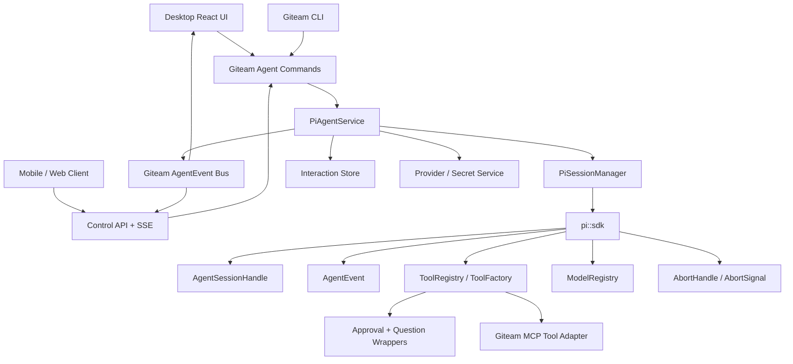
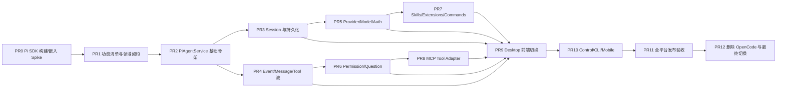

# Giteam 基于 Pi SDK 的 Agent 底层重构计划

> **状态：** 执行中（PR0/PR1 已完成首轮，PR2 基础骨架进行中）  
> **制定日期：** 2026-07-27  
> **目标运行时：** `pi_agent_rust` / `pi::sdk` 进程内 SDK  
> **目标平台：** macOS、Windows、Ubuntu（x64；发布矩阵同时验证 macOS arm64 和 Ubuntu arm64）  
> **Pi 调研基线：** `Dicklesworthstone/pi_agent_rust` `main@b27abd576cc0d2f39e2eef8f87f7897edec53b4f`，crate `pi_agent_rust` `0.1.22`  
> **重要决策：** 产品最终不再支持 OpenCode。OpenCode 代码只能在重构期间作为行为参考或一次性数据迁移输入，不能作为运行时、回退方案或发布依赖。

## 1. 目标

将 Giteam 当前依赖 OpenCode 的全部 Agent 底层能力，重构为基于 Pi SDK 的单一运行时实现：

1. Desktop、CLI、Mobile/Web Control Server 的 Agent 请求全部进入 Giteam 自有的 Pi 服务层。
2. 所有模型调用、会话、流式事件、工具执行、取消、Provider、认证、权限、Question、Skills、Extensions 和 MCP 能力最终都由 `pi::sdk` 或基于 `pi::sdk` 构建的 Giteam 扩展完成。
3. 现有产品能力在 Pi SDK 上实现功能等价，而不是只实现一个基础聊天 Demo。
4. 不保留 OpenCode runtime、OpenCode service process、OpenCode HTTP/SSE、OpenCode binary、OpenCode port 配置或 OpenCode API 兼容路由。
5. macOS、Windows、Ubuntu 均完成构建、安装、运行、模型调用、工具执行、会话恢复和升级验证。
6. 迁移完成后，前端和多端客户端不认识 OpenCode 协议，也不直接认识 Pi SDK 内部事件；它们只消费 Giteam 自己定义的稳定应用协议。

## 2. 非目标

本计划不做以下事情：

- 不继续支持 OpenCode 作为可选运行时。
- 不实现 `OpenCodeAdapter`、双运行时 flag、按仓库回退或 OpenCode fallback。
- 不保留 `/api/v1/opencode/**` 作为长期兼容路由；这是一次明确的破坏性底层替换，Control API 应同步切换到 `/api/v1/agent/**`。
- 不把 Pi SDK 直接暴露给 React、Mobile、CLI 或外部 HTTP API。
- 不把 OpenCode 的消息、Permission、Question、MCP 等协议类型原样搬到新实现中。
- 不把 `pi --mode rpc` 作为产品运行时替代进程内 SDK；若进程内集成遇到问题，优先修复依赖、隔离异步边界、升级/补丁 Pi SDK 或维护 Pi fork。
- 不自动删除用户的 OpenCode 文件；如需要数据迁移，使用一次性离线迁移工具，迁移后运行时不再读取 OpenCode。
- 不以“编译通过”代替 Windows、macOS、Ubuntu 的真实功能验收。

## 3. 当前架构评估

### 3.1 结论

OpenCode 已经深入 Giteam 的多个层面，不存在安全的单点替换位置。当前依赖同时覆盖：

- 本地 OpenCode 服务进程生命周期；
- HTTP/SSE 会话协议；
- Provider、模型和认证配置；
- 会话持久化、分页和工作区绑定；
- 消息 Part、思考过程和工具执行事件；
- Permission 与 Question 交互；
- MCP 状态、认证和生命周期；
- Skills 安装、市场搜索和 MCP manifest 同步；
- Desktop、CLI、Mobile/Web Control Server 共用路径。

因此本项目采用“**Pi SDK 单运行时重构**”，而不是“OpenCode API 换成另一个 API”。重构目标是建立 Giteam 的产品领域层和 Pi SDK 实现层：

```text
Desktop / Mobile / CLI
        ↓
Giteam Agent API + Giteam Agent Events
        ↓
PiAgentService + PiSessionManager
        ↓
pi::sdk
        ├── AgentSessionHandle
        ├── AgentEvent
        ├── ToolFactory / ToolRegistry
        ├── ModelRegistry
        └── AbortHandle / AbortSignal
```

### 3.2 后端关键耦合点

| 模块 | 当前职责 | 规模/证据 | 新实现要求 | 优先级 |
|---|---|---:|---|---|
| `crates/giteam-core/src/opencode.rs` | OpenCode 进程、HTTP/curl、Session、Provider、认证、MCP、Skills、权限 | 约 5511 行 | 作为重构参考，按能力拆入 `pi_agent`；最终删除 | P0 |
| `crates/giteam-core/src/control.rs` | Mobile/Web API 与 SSE，直接调用 `opencode::*` | 约 3391 行 | 改成 `PiAgentService` + 新 `/api/v1/agent/**` | P0 |
| `crates/giteam-core/src/desktop_rpc.rs` | Desktop Web/CLI RPC dispatch，直接调用 `super::opencode` | 多组 OpenCode dispatch | 改成 Pi Agent command dispatch | P0 |
| `crates/giteam-core/src/command_runner.rs` | OpenCode PATH 和命令执行环境 | OpenCode PATH 逻辑 | 删除 OpenCode PATH；保留跨平台工具执行基础设施 | P1 |
| `crates/giteam-core/src/lib.rs` | 暴露 `opencode` 模块 | `pub mod opencode` | 暴露 `pi_agent`；最终移除 `opencode` | P0 |
| `apps/desktop/src-tauri/src/main.rs` | 注册约 60 个 OpenCode commands | command handler 清单 | 注册 Pi Agent commands | P0 |
| `apps/cli/src/main.rs`、`doctor.rs` | OpenCode 配置、安装检查、warmup/shutdown | 直接依赖 core OpenCode API | 改成 Pi SDK 初始化和诊断 | P1 |
| `apps/cli/npm-src/**` | npm 发布时的 Rust 源码快照 | 由 `sync-rust-sources.js` 生成 | 修改源文件后重新生成，不手工维护 | P1 |
| `ARCHITECTURE.md` | 当前架构说明 | 含 OpenCode 运行时假设 | 改成 Pi SDK 单运行时架构 | P1 |

当前 OpenCode 运行方式包括：

- 启动 `opencode serve --hostname 127.0.0.1 --port 4098`；
- 维护 `ManagedOpencodeService` 和 `OPENCODE_SERVICE_POOL`；
- 通过 HTTP、curl、CLI 和配置文件混合访问；
- 使用 `~/.local/share/opencode/auth.json` 保存认证；
- macOS 下使用 `~/Library/Application Support/giteam/opencode-service.json` 保存服务设置。

这些进程、端口、文件和设置在最终版本全部移除或转为一次性迁移输入。

### 3.3 Desktop 前端关键耦合点

`apps/desktop/src/App.tsx` 约 9311 行，当前直接完成 Agent 编排：

- 调用 `get_opencode_service_base`；
- 直接访问 `/global/event`、`/session/{id}/prompt_async`、`/session/{id}/message`、`/session/{id}/abort`、`/command`、`/question`；
- 自行解析 SSE frame；
- 识别 `message.updated`、`message.part.updated`、`message.part.delta`、`question.*`、`permission.*` 和 `session.*`；
- 维护本地消息 ID 与 OpenCode 服务端消息 ID 映射；
- 流结束后重新拉取完整消息修正流式结果。

主要耦合文件：

- `apps/desktop/src/App.tsx`
- `apps/desktop/src/lib/opencodeSessions.ts`
- `apps/desktop/src/lib/opencodeParts.ts`
- `apps/desktop/src/lib/opencodePermissions.ts`
- `apps/desktop/src/lib/opencodeQuestions.ts`
- `apps/desktop/src/lib/opencodeProviderCatalog.ts`
- `apps/desktop/src/lib/opencodeProviders.ts`
- `apps/desktop/src/lib/opencodeMcpConfig.ts`
- `apps/desktop/src/lib/opencodeAgents.ts`
- `apps/desktop/src/lib/useOpencodeInstalledSkills.ts`
- `apps/desktop/src/lib/useOpencodeSkillMarketplace.ts`
- `apps/desktop/src/lib/useOpencodeMessageCache.ts`
- `apps/desktop/src/components/opencode/**`
- `apps/desktop/src/components/mcp/McpMarketplace.tsx`
- `apps/desktop/src/components/settings/RuntimeSetupDialog.tsx`
- `apps/desktop/src/components/settings/SettingsDialog.tsx`

迁移后可以暂时保留目录或组件文件名，避免一次性引入无关 UI diff；但代码内容和数据类型必须改成 Pi/Giteam 语义，最终在清理阶段统一改名。

### 3.4 历史副本与生成物风险

`apps/desktop/src-tauri/src/commands/mod.rs` 当前使用：

```rust
pub use giteam_core::control;
pub use giteam_core::opencode;
```

因此以下文件疑似历史遗留副本，而不是当前模块树中的真实实现：

- `apps/desktop/src-tauri/src/commands/opencode.rs`（约 3231 行）
- `apps/desktop/src-tauri/src/commands/control.rs`

在重构早期不要凭文件名直接删除，应先通过编译模块图、`rg`、构建和运行验证确认；确认未参与构建后，可在 OpenCode 清理 PR 中删除。

`apps/cli/npm-src/**` 是 `apps/cli/scripts/sync-rust-sources.js` 的生成输出。应修改真实源文件，再运行同步脚本；不能把生成目录当作独立实现维护。

## 4. Pi SDK 能力与功能等价要求

### 4.1 已确认的 Pi SDK 表面

调研基线的稳定入口是 `pi::sdk`，包含：

- `create_agent_session(SessionOptions)`；
- `AgentSessionHandle`；
- `AgentEvent`；
- `SessionTransport`；
- `AbortHandle` / `AbortSignal`；
- `ModelRegistry`；
- `ToolRegistry` / `ToolFactory`；
- 内建工具构造器；
- Session state、model、thinking、compaction 和 prompt 相关接口。

本项目产品运行时只使用 `pi::sdk` 的进程内能力。`SessionTransport::RpcSubprocess` 和 `RpcTransportClient` 可作为技术验证对象，但不能成为逃避进程内集成问题的产品替代方案。

`SessionOptions` 关键字段：

- provider、model、api_key；
- thinking；
- system_prompt / append_system_prompt；
- enabled_tools；
- working_directory；
- session_path / session_dir；
- extension_paths；
- extension_policy / repair_policy；
- max_tool_iterations；
- tool_factory；
- on_event、on_tool_start、on_tool_end、on_stream_event。

Pi 事件包括：

- `AgentStart` / `AgentEnd`；
- `TurnStart` / `TurnEnd`；
- `MessageStart` / `MessageUpdate` / `MessageEnd`；
- `ToolExecutionStart` / `Update` / `End`；
- `AutoCompactionStart` / `End`；
- `AutoRetryStart` / `End`；
- `ExtensionError`。

### 4.2 现有功能 → Pi 实现矩阵

| 现有 Giteam 能力 | Pi SDK 实现 | 额外 Giteam 实现 | 完成标准 |
|---|---|---|---|
| 创建/打开/删除 Session | `create_agent_session`、`session_path`、`session_dir` | `PiSessionManager`、元数据索引、恢复 | CRUD、分页、重启恢复、多仓库隔离 |
| Prompt | `AgentSessionHandle::prompt` | `PiAgentService` 调度和状态机 | 文本、附件、系统提示、错误完整可用 |
| 流式文本 | `AgentEvent::MessageUpdate` | Giteam Event Bus、前端 reducer | delta 无重复、无丢失、断线可恢复 |
| 思考过程 | Pi stream/event payload | `reasoning` 统一 Part | UI 可展示、持久化、可关闭 |
| 工具执行 | `ToolRegistry`、内建工具、`ToolFactory` | 审批包装、进度、输出截断、安全审计 | read/write/execute 工具全部有状态闭环 |
| Abort | `AbortHandle` / `AbortSignal` | run registry、幂等终止、资源释放 | abort 后不再执行新工具，最终状态可见 |
| Session 状态 | Pi session state/events | Giteam 状态快照 | active/idle/error/aborted 状态一致 |
| Provider 列表 | `ModelRegistry` | Giteam Provider catalog | 当前 UI 支持的 Provider 全部可选 |
| 模型切换 | `set_model` | ID 映射、能力校验、持久化 | Provider/model/thinking 切换可恢复 |
| 自定义 Provider | Pi model/provider 配置能力 | custom endpoint、headers、参数 UI | 当前已有自定义 Provider 字段不丢失 |
| 认证 | `SessionOptions::api_key` 等 Pi 入口 | Giteam secret store、导入流程 | 不进日志、不进普通 JSON、不丢失 |
| OpenCode Permission | 无直接同构 | `ToolFactory` approval wrapper + Interaction Store | once/always/reject、超时、跨端审批 |
| OpenCode Question | 无直接同构 | 自定义 Pi Tool + Interaction Store | 单选、多选、文本、取消、校验 |
| Agent | 无需保留 OpenCode Agent | Pi system prompt、extension、tool profile | 当前 Agent 预设行为等价 |
| Command | 无需保留 OpenCode Command | Giteam prompt command registry / Pi skill | 现有 command 可发现、执行、流式返回 |
| Skills 列表/安装/删除 | Pi global/project Skills | 市场、审计、来源组、安装状态 | 现有市场能力在 Pi 目录生效 |
| Extensions | `extension_paths`、policy | Giteam 安装、启用、诊断 | 兼容能力可见，不支持项有错误 |
| MCP 列表/新增/连接/断开 | Pi SDK 没有同构管理面 | 基于 `ToolFactory` 的 MCP Tool Adapter | MCP server lifecycle 和工具调用可用 |
| MCP 认证 | Pi SDK 没有同构管理面 | Giteam auth store/transport adapter | stdio/http/OAuth 按支持矩阵完成 |
| Session message history | Pi session files | 统一分页、索引、损坏恢复 | 历史消息可检索、打开、删除 |
| Model test | Pi 一次性 session/prompt | 诊断、超时、脱敏 | 设置页测试结果可靠 |
| Stats | Pi event/usage 信息 | Giteam usage store/统计接口 | 当前 UI 所需统计字段全部有来源 |
| Image attachments | Pi provider/model message input | Desktop 文件读取、大小/类型校验 | 当前支持的附件模型全部验证 |
| Control API | 直接调用 Pi service | `/api/v1/agent/**` + SSE | Mobile/Web 全功能可用 |
| CLI warmup/shutdown | 初始化/释放 Pi service | 跨平台诊断和信号处理 | CLI 不再查找/启动 OpenCode |

矩阵中的“无直接同构”不是降级理由。对于 Permission、Question、MCP、Stats 等功能，必须在 Giteam 内基于 `pi::sdk` 的 ToolFactory、AgentEvent 和服务层补齐实现。

### 4.3 构建与工具链硬风险

已做不修改仓库的临时依赖解析：

```toml
pi = {
  package = "pi_agent_rust",
  version = "=0.1.22",
  default-features = false
}
```

结果：

- 即使关闭 default features，仍解析约 538 个 package；
- 当前本机 Giteam 使用 `rustc 1.93.1 stable`，项目 edition 为 2021；
- 临时 `cargo check` 因传递依赖失败：
  - `kstring 2.0.4` 要求 Rust 1.96；
  - `sysinfo 0.39.6` 要求 Rust 1.95；
- Pi 上游 crate 为 edition 2024、声明 `rust-version = 1.85`，但上游实际锁定 `nightly-2026-07-05`。

**硬性处理原则：** 这些问题必须通过 Pi SDK 版本、依赖锁、workspace toolchain、上游修复或维护 fork 解决；不能因为工作量而切换成 OpenCode、远程服务或非 Pi 的 Agent 实现。

### 4.4 Rust Pi SDK 与 TypeScript/React Pi 的兼容性评估

Pi 生态存在 Rust 与 TypeScript 两条实现线，但没有一个可以直接替换 Giteam 当前 React/Tauri 架构的“React SDK”：

- Rust 线：`pi_agent_rust`，稳定嵌入入口是 `pi::sdk`。
- TypeScript 线：`@mariozechner/pi-agent-core`、`@mariozechner/pi-coding-agent`、`@mariozechner/pi-ai`。
- UI 线：`@mariozechner/pi-web-ui`，当前基于 `mini-lit` Web Components 和 Tailwind，不是 React 组件库。

| 兼容维度 | Rust `pi::sdk` | TypeScript Pi / Web UI | 结论 |
|---|---:|---:|---|
| `giteam-core`、Tauri、CLI 直接集成 | 高 | 低，需要 Node sidecar/IPC | Rust 更适合底层 |
| Desktop/Control/Mobile 共用实现 | 高 | 低，需要额外 Node 后端 | Rust 更适合共享核心 |
| macOS/Windows/Ubuntu 工具和文件权限 | 高 | 中，需要 Node 和 sidecar 分发 | Rust 更容易做单一原生包 |
| 当前 React UI 复用 | 高，通过 Giteam Agent API | 中高，但 Web UI 要包 Web Component | 不应引入第二套 UI |
| Pi 上游 coding-agent 现成功能 | 中高，需要在 SDK 上补产品能力 | 高，但依赖 Node/fs/child_process | TypeScript 作为行为参考 |
| secret、MCP、进程生命周期边界 | 高，可在 Giteam Rust 服务内统一 | 中，需要跨 Node/Tauri/移动端 IPC | Rust 更容易统一 |

**结论：** 对 Giteam 的整体兼容性最高的是 **Rust `pi::sdk` 进程内实现**。Giteam 保留现有 React 作为 UI 技术栈，但不把 TypeScript Pi 或 `pi-web-ui` 作为 Agent 运行时接入。TypeScript Pi 的 Agent event、Session、Tool、Extension 和功能实现用于对照测试与行为参考，最终生产实现仍必须进入 `PiAgentService` → `pi::sdk`。

这不是选择另一个方案，而是明确 Pi SDK 的落地层次：Rust Pi SDK 负责产品底层，React 负责 Giteam UI，二者之间使用 Giteam 自有命令和事件契约。

## 5. Pi SDK 单运行时目标架构



建议目录：

```text
crates/giteam-core/src/pi_agent/
├── mod.rs
├── error.rs
├── types.rs              # Giteam Agent 请求/响应/事件类型
├── service.rs            # PiAgentService，唯一产品运行时入口
├── manager.rs            # 多 repo、多 session、active run、取消与 shutdown
├── events.rs             # AgentEventBus、sequence、重连和快照
├── sessions.rs           # Pi session 持久化与 Giteam metadata 索引
├── messages.rs           # Pi message/stream → Giteam message parts
├── providers.rs          # Provider、Model、Thinking、认证
├── interactions.rs       # Permission/Question 状态机
├── skills.rs             # Skills/Commands/Agent preset
├── extensions.rs         # Pi extension 加载、policy、诊断
└── tools/
    ├── mod.rs
    ├── approval.rs       # ToolFactory 包装和审批
    ├── question.rs       # Question tool
    └── mcp.rs            # MCP → Pi ToolRegistry 适配
```

前端建议目录：

```text
apps/desktop/src/lib/agent/
├── types.ts
├── agentApi.ts
├── eventReducer.ts
├── sessionStore.ts
├── interactionStore.ts
└── useAgentController.ts

apps/desktop/src/components/agent/
└── ...
```

前端只能消费 Giteam 类型和事件，不能 import `pi` 的 TypeScript/Rust 表示，也不能把 Pi `AgentEvent` 直接发给客户端。

### 5.1 单一运行时规则

最终版本必须满足：

- 不存在 `runtimeKind` 选择项；
- 不存在 `opencode`、`pi-in-process`、`pi-rpc` 三选一设置；
- 不存在 OpenCode fallback；
- 不存在 OpenCode port/base URL；
- 不存在 OpenCode service warmup/shutdown；
- 不存在 `/api/v1/opencode/**`；
- 所有 Agent command 都调用 `PiAgentService`；
- 任何 Pi SDK 缺口由 Giteam 扩展、Pi SDK 上游修复或 Pi fork 解决。

在开发过程中，旧 OpenCode 源码可以暂时保留用于对照测试；但它不应被新代码引用，且必须在最终清理 PR 删除。

### 5.2 中立应用事件

领域层不直接暴露 Pi SDK 类型，但也不再抽象成可替换运行时。建议定义：

```text
run.started
run.completed
run.failed
run.aborted
turn.started
turn.completed
message.started
message.delta
reasoning.delta
message.completed
tool.started
tool.progress
tool.completed
interaction.requested
interaction.resolved
session.status
runtime.retry
runtime.compaction
runtime.warning
```

每个事件至少包含：

- `eventId`、单调递增 `sequence`；
- `repoId/repoPath`、`sessionId`、`runId`；
- `timestamp`；
- schema version；
- 脱敏 payload。

事件由 `PiAgentService` 从 `pi::sdk::AgentEvent` 归一化后输出到 Tauri Event、Control SSE 和 CLI stream。

## 6. 依赖图与并行工作流



可并行部分：

- PR3 与 PR4 在 PR2 的接口稳定后并行。
- PR5、PR6、PR7、PR8 在核心 service 和领域类型完成后并行，但共享 `types.rs` 的变更必须先冻结 schema。
- PR9 可在后端事件/会话契约稳定后并行开发，合并依赖 PR3、PR4、PR5、PR6。
- PR11 的平台自动化可以在 PR9 开发完成后提前搭建，但必须使用 Pi SDK 真实实现，不允许用 OpenCode mock 代替。

不可跳过的依赖：

- 未完成 PR0，不接入主 workspace 的默认构建。
- 未完成 PR1，不开始功能重构。
- 未完成 PR3/PR4，不切换 Desktop 主聊天路径。
- 未完成 PR5/PR6，不切换会话和 Provider 设置。
- 未完成 PR6/PR8，不宣称工具审批和 MCP 功能完成。
- 未完成 PR11，不删除 OpenCode 源码和配置清理逻辑。

## 7. 分阶段执行计划

每个 PR 使用独立分支，建议命名为 `codex/pi-sdk-*`。阶段内允许旧 OpenCode 代码暂存，但不能新增任何对 OpenCode 的功能依赖。

### PR0 — Pi SDK 工具链、进程内嵌入与跨平台 Spike（硬门禁）

**执行状态（2026-07-27）：** 首轮门禁通过；已进入主 `giteam-core`、Desktop Tauri 和 CLI 依赖图。Windows/Ubuntu 原生矩阵和真实 Provider 闭环仍未完成。

**目标：** 确认 `pi::sdk` 可以作为 Giteam 唯一生产运行时，并解决所有构建与异步集成问题。

**主要文件：**

- 新建 `docs/adr/0001-use-pi-sdk-as-the-only-agent-runtime.md`
- 新建隔离 Spike，例如 `crates/pi-sdk-spike/`
- 按结果修改 workspace/toolchain/Cargo 配置
- 修改 CI workflow，加入 macOS、Windows、Ubuntu 构建矩阵

**任务：**

- [ ] 精确锁定 `pi_agent_rust` 版本或 commit，禁止依赖浮动 `main`。
- [ ] 验证 `nightly-2026-07-05`、稳定版和依赖 pin/patch 方案；最终选择一个可复现方案。
- [ ] 验证 macOS arm64/x64、Windows x64、Ubuntu x64/arm64 的 `cargo check` 和 release build。
- [ ] 在 Tauri 实际依赖图中验证 Pi SDK、TLS、SQLite、系统库和 feature 不冲突。
- [ ] 完成进程内最小闭环：创建 `AgentSessionHandle` → prompt → 收到文本事件 → 调用工具 → abort → shutdown。
- [ ] 验证 Pi SDK 异步 Future 与当前 Tauri/Tokio/线程边界、`Send`/`Sync` 和取消语义。
- [ ] 测量编译时间、依赖数量、release 体积、冷启动、首事件延迟、内存和 100 次 Prompt/Abort 稳定性。
- [ ] 验证 Windows 路径、命令执行、环境变量、编码和文件锁；验证 macOS sandbox/notarization；验证 Ubuntu 动态库和权限。
- [ ] 如果上游 SDK 不满足集成要求，记录需要的 Pi SDK patch、fork 或上游 PR；不得改用 OpenCode 或非 Pi 运行时。

**当前 Spike 结果（2026-07-27）：**

- 当前 stable `rustc 1.93.1` 无法构建 crates.io `pi_agent_rust 0.1.22`，触发 `sysinfo 0.39.6` 的 MSRV 错误。
- `nightly-2026-07-05` + crates.io `0.1.22` 仍触发上游 `Future + Send` 错误。
- `nightly-2026-07-05` + 上游 commit `b27abd576cc0d2f39e2eef8f87f7897edec53b4f` 已在当前 macOS 完成 `cargo check` 和编译期启动检查。
- 上游 `main` 当前仍指向该 commit；Windows/Ubuntu 和 Tauri 真实依赖图仍待验证。

**验收：**

- 三类操作系统均完成构建和最小闭环。
- 进程内 Pi session 可以可靠取消，不出现死锁、僵尸任务或资源不释放。
- Pi SDK 依赖锁和工具链可在 CI 中复现。
- ADR 明确采用 `pi::sdk` 进程内模式；不存在产品 RPC fallback 方案。

**回滚：** 仅删除隔离 Spike 和未接入主路径的依赖/CI 改动。若失败，任务状态为“Pi SDK 集成阻塞”，下一步是修复 Pi SDK/依赖，而不是选择其他 Agent 后端。

**验证命令：**

```bash
cargo tree --manifest-path <spike>/Cargo.toml -d
cargo check --manifest-path <spike>/Cargo.toml
cargo build --release --manifest-path <spike>/Cargo.toml
```

---

### PR1 — 功能清单、Pi 领域模型与契约测试

**执行状态（2026-07-27）：** 第一版 Giteam 事件、消息和 Session 状态契约已实现并通过 5 个契约测试；完整能力矩阵和 golden fixtures 仍在补齐。

**目标：** 将当前 OpenCode 实现中的全部产品能力登记为可验收清单，并定义不泄漏 Pi 内部类型的 Giteam 应用契约。

**主要文件：**

- 新建 `crates/giteam-core/src/pi_agent/{mod,error,types,events,messages}.rs`
- 修改 `crates/giteam-core/src/lib.rs`
- 新建 `crates/giteam-core/tests/pi_agent_contract.rs`
- 新建 `crates/giteam-core/tests/fixtures/pi-agent-events/*.json`
- 修改 `ARCHITECTURE.md`

**任务：**

- [ ] 从 `crates/giteam-core/src/opencode.rs`、`control.rs`、`desktop_rpc.rs`、Desktop `App.tsx` 和全部相关 hooks/components 建立逐项功能清单。
- [ ] 定义 `AgentSessionSummary`、`AgentMessage`、`AgentPart`、`ToolCall`、`Provider`、`Model`、`Interaction`、`AgentError`。
- [x] 定义 `AgentEventEnvelope`、sequence、schema version、run/session/repo identity。
- [ ] 定义 Prompt、Abort、Session CRUD/List/Page、Provider、Model、Skill、MCP、Permission、Question 的输入输出。
- [x] 第一阶段统一 api key 的 Debug 脱敏规则；OAuth token、cookie、Authorization header 在 Provider/Auth 阶段补齐。
- [ ] 建立 Pi Event → Giteam Event 的 golden fixture 规范。
- [ ] 明确每项原 OpenCode 能力的 Pi SDK 实现方式、额外 Giteam 实现和验收测试。
- [x] 新领域契约不包含 `Opencode*` 类型、OpenCode URL、OpenCode port 或 OpenCode 命名。

**验收：**

- 功能矩阵覆盖当前所有已注册 Tauri commands、Control routes、CLI commands 和前端调用路径。
- 契约可以表达文本、reasoning、附件、工具进度、审批、问题、错误、重试、压缩和恢复。
- 契约测试不依赖真实模型网络。

**回滚：** 删除未接线的 `pi_agent` 领域模块；不影响旧源码，但不增加任何新的 OpenCode 依赖。

---

### PR2 — `PiAgentService` 与 Pi SDK 基础骨架

**执行状态（2026-07-27）：** 已实现第一版进程内 Session、Prompt、流式事件归一、Abort registry、并发互斥、Desktop Tauri/RPC 新命令入口和 Control `/api/v1/agent/**` 基础路由；旧主聊天 UI、旧 Control/RPC 路由和 Provider/交互能力仍在迁移中。

**目标：** 建立唯一底层入口，所有新代码只通过 `PiAgentService` 调用 `pi::sdk`。

**主要文件：**

- 新建 `crates/giteam-core/src/pi_agent/service.rs`
- 新建 `crates/giteam-core/src/pi_agent/manager.rs`
- 新建 `crates/giteam-core/src/pi_agent/config.rs`
- 修改 `crates/giteam-core/Cargo.toml`
- 修改 `crates/giteam-core/src/lib.rs`

**任务：**

- [x] 按 PR0 ADR 将 Pi SDK 依赖加入真实 workspace，并锁定版本、features 和 toolchain。
- [x] 实现 `PiAgentService` 初始化、shutdown、健康状态和错误边界（应用退出时 abort active runs、清空事件订阅和释放 session handles）。
- [x] 实现每个 repo 的 working directory、session manager 和 active run registry。
- [x] 将 `SessionOptions` 中 provider/model/system prompt/enabled tools/working directory 统一由 Giteam config 构造；thinking 配置待 Provider 阶段接入。
- [x] 将 `no_session` 显式设置为 `false`，并定义 session path/dir 规则。
- [ ] 为每个 session 保存 Pi handle、订阅 ID、abort handle 和生命周期状态（当前保存 handle、active run registry 和事件总线；持久化订阅/生命周期快照待补）。
- [x] 所有 Pi SDK 错误转换为 Giteam `PiAgentError`，不得把 Pi 内部错误结构直接发给客户端。
- [x] 定义应用退出时的 shutdown 顺序：停止接受新请求 → abort active runs → 清理事件订阅 → 释放 Pi sessions；metadata flush 会在 PR3 的持久化 catalog 接入后补上。

**验收：**

- 新 service 能独立创建和关闭 Pi session；Desktop Tauri 退出回调已接入 shutdown。
- Desktop/CLI 尚未切换，但新 service 已有真实 Pi SDK 单元/集成测试。
- 代码中不存在第二个 Agent 后端入口。

**验证：**

```bash
cargo test --manifest-path crates/giteam-core/Cargo.toml pi_agent
cargo check --manifest-path crates/giteam-core/Cargo.toml
```

**回滚：** 暂时移除新 service 的调用接线；不得新增 OpenCode 兼容层作为替代。

---

### PR3 — Session、历史记录和多仓库恢复

**目标：** 在 Pi 持久化模型上恢复当前 Giteam 的 session 产品能力。

**主要文件：**

- 修改 `crates/giteam-core/src/pi_agent/manager.rs`
- 新建 `crates/giteam-core/src/pi_agent/sessions.rs`
- 新建 `crates/giteam-core/src/pi_agent/pi_sessions.rs`
- 修改现有 SQLite metadata/migration 模块

**任务：**

- [ ] 定义 repo identity：规范化绝对路径、symlink、大小写和跨平台路径分隔符。
- [ ] 使用 Pi session 文件保存消息事实；Giteam DB 保存 title、repo、最近访问、归档、runtime schema version 等元数据。
- [ ] 实现 create/list/open/rename/archive/delete/page/resume。
- [ ] 实现多 repo、多 session handle pool；同一 session 的 run 排他，不同 session 可并行。
- [ ] 实现有界缓存、LRU、显式 close、应用退出 shutdown 和崩溃恢复。
- [ ] 对 session 文件损坏、缺失、版本不兼容提供 quarantine 和恢复提示。
- [ ] 处理 Windows 文件锁、macOS 文件权限、Ubuntu 并发读写。
- [ ] 明确 session path 中不保存明文 api key。

**验收：**

- 至少 3 个仓库、每个 3 个 session 可以切换且不串消息。
- 重启应用后 Pi session 可恢复，历史消息完整可读。
- 删除只删除目标 Pi session 和对应 metadata，不误删仓库文件。
- 100 次 session 切换和 20 次并发恢复无句柄/线程持续泄漏。

**回滚：** 仅回退未发布的 Pi session metadata migration；不删除已创建的 Pi session 文件。

---

### PR4 — Pi Event、消息 Part、工具流和 Abort

**目标：** 完成 Agent 核心执行闭环，让现有聊天界面能够完全消费 Pi SDK 事件。

**主要文件：**

- 修改 `crates/giteam-core/src/pi_agent/events.rs`
- 修改 `crates/giteam-core/src/pi_agent/messages.rs`
- 新建 `crates/giteam-core/src/pi_agent/tools/mod.rs`
- 修改 `apps/desktop/src-tauri/src/main.rs`
- 新建 `apps/desktop/src-tauri/src/commands/agent.rs`

**任务：**

- [ ] 订阅 Pi `AgentEvent`，归一化为 Giteam event envelope。
- [ ] 支持 message start/update/end、text delta、reasoning delta、tool start/update/end、retry、compaction、extension error。
- [ ] 为事件分配 session/run/sequence，支持重连 cursor 和 terminal snapshot。
- [ ] 实现 Prompt、Prompt with attachments、Abort、Get State、Get Messages。
- [ ] 实现大输出截断策略、异常工具输出、Unicode/CJK、换行和二进制附件边界。
- [ ] Abort 必须取消当前 Pi future、阻止后续工具、关闭 pending interactions 并发布 terminal event。
- [ ] 将 Tauri command、Desktop Event 和 Control SSE 使用同一事件源。
- [ ] 建立 Pi event fixtures 和真实模型之外的 fake provider/tool harness。

**验收：**

- 文本、思考、工具执行在 UI 中连续且不重复。
- 断线重连不会重复追加消息，sequence gap 能触发 snapshot reconcile。
- Abort 后不会继续执行新工具，且最终状态稳定为 aborted 或 failed。
- 错误、重试和自动压缩不会让 session 卡在 running。

**验证：**

```bash
cargo test --manifest-path crates/giteam-core/Cargo.toml pi_agent
npm --prefix apps/desktop run build
```

**回滚：** 不存在 OpenCode fallback；若 UI 问题，只回退前端接线到旧 UI，不回退 Agent 后端。Pi service 仍作为唯一实现修复。

---

### PR5 — Provider、Model、Thinking 和认证

**目标：** 使用 Pi `ModelRegistry` 和 Giteam 自有配置实现当前 Provider/模型全部能力。

**主要文件：**

- 修改 `crates/giteam-core/src/pi_agent/providers.rs`
- 新建 `crates/giteam-core/src/pi_agent/secrets.rs`
- 适配 `apps/desktop/src/lib/opencodeProviderCatalog.ts`
- 适配 `apps/desktop/src/lib/opencodeProviders.ts`
- 适配 `apps/desktop/src/lib/useOpencodeModelSelection.ts`
- 适配 Provider/Auth/Custom Provider UI
- 修改 CLI `doctor.rs` 和配置命令

**任务：**

- [ ] 从 Pi `ModelRegistry` 构造 Giteam Provider/Model catalog。
- [ ] 统一 Provider ID、model ID、thinking level、context window、image support、tool support 和 pricing/usage metadata。
- [ ] 支持当前产品已有 Provider、模型选择、默认模型、隐藏模型、自定义 endpoint 和参数配置。
- [ ] 对 Pi 不支持的字段实现 Giteam 扩展或明确阻塞错误，不静默丢失配置。
- [ ] 实现 secret store；api key/OAuth token 不进入普通 JSON、Debug、事件、命令行或 Control 响应。
- [ ] 提供一次性 OpenCode credential import utility 仅用于迁移现有用户配置；迁移后运行时不读取 OpenCode 文件。
- [ ] 导入前预览、用户确认、原文件备份、原子写入、失败回滚。
- [ ] 实现模型连通性测试，包含 timeout、取消和脱敏错误。

**验收：**

- 当前产品支持的 Provider 全部完成配置、模型列表、切换和测试。
- 关闭/重启应用后 Provider/model/thinking 配置保持一致。
- 任意日志和诊断输出都无法检索出密钥。
- 迁移工具失败不会破坏源文件，也不会让 Pi 配置进入半完成状态。

**回滚：** 修复 Pi provider adapter 或配置迁移；不恢复 OpenCode 读取路径。

---

### PR6 — ToolFactory、Permission 和 Question

**目标：** 在 Pi SDK 上完整重建 OpenCode 原有审批和提问体验。

**主要文件：**

- 修改 `crates/giteam-core/src/pi_agent/interactions.rs`
- 新建 `crates/giteam-core/src/pi_agent/tools/approval.rs`
- 新建 `crates/giteam-core/src/pi_agent/tools/question.rs`
- 修改 `PiAgentService` 的 `ToolFactory`
- 适配 Desktop Permission/Question stores、dock 和 Mobile handlers

**任务：**

- [ ] 按工具风险分级：read、write、execute、network、extension、MCP。
- [ ] 用 `ToolFactory` 包装需要审批的 Pi tools，执行前创建 pending interaction。
- [ ] 实现 once/always/reject，明确 session/repo/global scope；默认最小权限。
- [ ] 实现 interaction timeout、abort、应用退出、客户端断线和重复回复。
- [ ] 实现 Giteam Question Tool，覆盖单选、多选、文本输入、取消、校验和默认值。
- [ ] interaction ID 使用不可预测随机值，并绑定 repo/session/run/tool call。
- [ ] Desktop/Mobile 同时在线时首个有效回复胜出，其他请求得到 resolved 状态。
- [ ] 自动接受必须显式配置、可审计；写文件、执行命令和网络访问默认不得静默放行。
- [ ] 记录审批审计事件，但不得记录敏感参数和完整 secret。

**验收：**

- 写文件、执行命令、网络和 MCP 工具在批准前绝不执行。
- reject、abort、timeout 都会释放 Pi future 和等待资源。
- Question 可以从 Desktop 和 Mobile 完成完整闭环。
- 伪造、跨 session、重复和过期 reply 全部被拒绝。

**验证：**

```bash
cargo test --manifest-path crates/giteam-core/Cargo.toml interactions
```

**回滚：** 修复 Pi ToolFactory/Interaction Store；不能通过关闭审批或绕过 Pi SDK 恢复功能。

---

### PR7 — Skills、Extensions、Agents 和 Commands

**目标：** 用 Pi Skills/Extensions 和 Giteam prompt registry 重建当前 Skills、Agent、Command 功能。

**主要文件：**

- 修改 `crates/giteam-core/src/pi_agent/skills.rs`
- 修改 `crates/giteam-core/src/pi_agent/extensions.rs`
- 迁移 `crates/giteam-core/resources/opencode-skills/**`
- 适配 `apps/desktop/src/lib/opencodeAgents.ts`
- 适配 `apps/desktop/src/lib/useOpencodeInstalledSkills.ts`
- 适配 `apps/desktop/src/lib/useOpencodeSkillMarketplace.ts`
- 适配 `apps/desktop/src/components/opencode/OpencodeSkillsPanels.tsx`

**任务：**

- [ ] 建立纯 Markdown Skill、Agent preset、Command、Extension 的 Pi 兼容矩阵。
- [ ] 将发现、审计、下载与安装目标解耦；安装目标必须是 Pi global/project Skills 或 extension path。
- [ ] 将 OpenCode 专有 frontmatter、agent YAML、command schema 转换为 Pi 可用格式；不兼容字段必须报错或人工确认。
- [ ] 迁移 `opencode-remote-repo` Skill，移除其中对 OpenCode command/API 的直接假设。
- [ ] 实现 Skills list/install/remove/install status/source groups/market search/audit/detail。
- [ ] 实现 extension_paths、extension_policy、repair_policy、启用/禁用和错误诊断。
- [ ] 维护 Pi extension 与 Giteam 工具审批、事件和 session 生命周期的边界。
- [ ] UI 最终改为 `agent`/`skills` 语义，不再出现 OpenCode 专属说明。

**验收：**

- 当前市场中的核心 Skills 可以搜索、审计、安装、使用、卸载。
- 当前 Agent/Command 入口均可从 UI 发现并执行。
- Extension 加载失败有明确错误，不会让整个 Desktop 无响应。
- Skill/Extension 的路径、权限和覆盖策略在 macOS/Windows/Ubuntu 一致。

**回滚：** 只回退未完成的 Skills/Extensions 功能，不影响基础 Prompt、Session 和 ToolFactory。

---

### PR8 — MCP Tool Adapter 和 MCP 生命周期

**目标：** 在 Pi SDK ToolRegistry 中接入 Giteam MCP，实现当前 MCP 管理与调用能力。

**主要文件：**

- 新建 `crates/giteam-core/src/pi_agent/tools/mcp.rs`
- 新建 `crates/giteam-core/src/pi_agent/mcp.rs`
- 适配 `apps/desktop/src/lib/opencodeMcpConfig.ts`
- 适配 `apps/desktop/src/components/opencode/OpencodeMcpPanels.tsx`
- 适配 `apps/desktop/src/components/mcp/McpMarketplace.tsx`
- 修改数据库/配置和 secret store

**任务：**

- [ ] 定义 MCP server、transport、auth、status、tool schema 和 error model。
- [ ] 实现 stdio 和 HTTP transport；按当前功能要求实现 OAuth/auth 生命周期。
- [ ] 通过 Pi `ToolFactory` 把 MCP tools 注册到当前 session 的 `ToolRegistry`。
- [ ] MCP tool 调用必须经过统一 Permission/Question 审批链。
- [ ] 实现 add/delete/connect/disconnect/auth/remove auth/list status。
- [ ] 处理 MCP server 启动、崩溃、重连、超时、取消、stdout/stderr 和进程清理。
- [ ] MCP 配置按 repo/project 隔离；secret 不进入 session 文件和普通日志。
- [ ] 适配 marketplace 和 manifest 同步，但安装目标和运行时全部为 Pi/Giteam。
- [ ] 验证不同平台的 stdio 进程启动、shell 参数、路径和编码差异。

**验收：**

- 至少一个 stdio server 和一个 HTTP server 完成连接、列工具、调用、取消、断开和恢复。
- MCP 工具在批准前不执行。
- MCP server 异常不拖垮 Pi session manager 或 Desktop 主进程。
- MCP 配置在重启后可恢复，删除操作不影响其他 repo。

**回滚：** 修复 MCP adapter 或暂时隐藏未完成 MCP UI；基础 Pi 工具和聊天仍必须可用，不能接回 OpenCode MCP。

---

### PR9 — Desktop 前端全面切换到 Pi Agent API

**目标：** 删除前端对 OpenCode HTTP/SSE 和 OpenCode 事件的理解。

**主要文件：**

- 新建 `apps/desktop/src/lib/agent/**`
- 新建 `apps/desktop/src/components/agent/**`
- 重构 `apps/desktop/src/App.tsx`
- 迁移 `apps/desktop/src/lib/opencode*.ts`
- 迁移 `apps/desktop/src/lib/useOpencode*.ts`
- 迁移 `apps/desktop/src/components/opencode/**`
- 修改 `apps/desktop/src/components/settings/RuntimeSetupDialog.tsx`
- 修改 `apps/desktop/src/components/settings/SettingsDialog.tsx`

**任务：**

- [ ] 建立唯一 `agentApi.ts`，封装 Tauri invoke 和 Web/Desktop RPC。
- [ ] 将 App.tsx 的 run 编排、stream reducer、message reconciliation、abort 和 interaction 处理移到 controller/store。
- [ ] 移除浏览器直接 fetch `/global/event`、`/session/**`、`/question`、`/command`。
- [ ] 移除 SSE frame parser 和 OpenCode event name switch。
- [ ] 所有消息 UI 使用 Giteam `AgentMessage/AgentPart`，不使用 Pi 原始类型。
- [ ] 将 `components/opencode/**` 逐步迁移到 `components/agent/**`，同时保持 UI 行为一致。
- [ ] Runtime Setup 中删除 OpenCode service base、port、binary、warmup 设置，改为 Pi SDK/Provider/Skills/MCP 设置。
- [ ] 增加 reducer 测试：text/reasoning/tool/approval/question/retry/compaction/abort/error/reconnect/duplicate/out-of-order。

**验收：**

- `rg` 不再发现前端 `/global/event`、`prompt_async`、OpenCode event name 或 OpenCode base URL。
- Desktop 可以完成完整 Prompt、工具、审批、Question、Session、Provider、Skills 和 MCP 流程。
- 刷新、切仓库、切 session、多窗口和断线重连不串流。
- 前端构建在 macOS、Windows、Ubuntu 的 Node 环境均通过。

**回滚：** 修复 Pi Agent API 或 controller；不回退到 OpenCode direct fetch。

---

### PR10 — Control Server、Desktop RPC、CLI 与 Mobile 全面切换

**目标：** 所有非 Desktop UI 入口都改为 PiAgentService，完成多端能力等价。

**主要文件：**

- 修改 `crates/giteam-core/src/control.rs`
- 修改 `crates/giteam-core/src/desktop_rpc.rs`
- 新建/修改 `apps/desktop/src-tauri/src/commands/agent.rs`
- 修改 `apps/desktop/src-tauri/src/main.rs`
- 修改 `apps/cli/src/main.rs`
- 修改 `apps/cli/src/doctor.rs`
- 修改 `apps/cli/README.md`
- 修改 `apps/mobile` Control API client（排除用户已有 `.expo` 删除变更）
- 通过 `apps/cli/scripts/sync-rust-sources.js` 生成 `apps/cli/npm-src/**`

**任务：**

- [ ] 删除 `/api/v1/opencode/**`，新增并统一 `/api/v1/agent/**`。
- [ ] Control API 与 Desktop RPC 共享 PiAgentService handler，禁止复制业务逻辑。
- [ ] Control SSE 输出统一 Giteam event envelope，支持 reconnect cursor/last event id。
- [ ] Mobile 实现 session list/open/create/delete、prompt/stream/abort、permission/question、provider/model、skills、MCP。
- [ ] CLI 的 warmup/shutdown 改成 Pi SDK service 初始化/释放；删除 OpenCode 安装和 PATH 检查。
- [ ] CLI doctor 检查 Pi toolchain、provider credential、session store、extension、MCP 和平台依赖。
- [ ] 删除 OpenCode service settings 和 port 配置 command。
- [ ] 更新 API 文档、Mobile client schema 和错误码。
- [ ] 运行源码同步脚本，确认 npm fallback source 与真实源一致。

**验收：**

- Desktop、Mobile/Web、CLI 可以操作同一套 Pi session 数据和能力。
- Mobile 在弱网、断线、重连和审批等待场景下行为正确。
- 外部 API 只出现 `/api/v1/agent/**`，不存在 OpenCode 路由别名。
- CLI 不需要安装或查找 OpenCode binary。

**验证命令：**

```bash
cargo check --manifest-path crates/giteam-core/Cargo.toml
cargo check --manifest-path apps/desktop/src-tauri/Cargo.toml
cargo check --manifest-path apps/cli/Cargo.toml
npm --prefix apps/desktop run build
node apps/cli/scripts/sync-rust-sources.js
npm --prefix apps/cli run prepublish:verify
```

**回滚：** 修复 Pi service/API；不能回滚到 OpenCode 路由或 OpenCode 进程。

---

### PR11 — 数据迁移、凭据迁移和历史处理

**目标：** 在不继续支持 OpenCode 的前提下，完成现有用户数据的可控迁移。

**主要文件：**

- 新建 `crates/giteam-core/src/pi_agent/migration.rs`
- 新建一次性迁移命令/工具
- 修改设置迁移和 onboarding UI
- 新增迁移测试 fixtures

**任务：**

- [ ] OpenCode session 只作为一次性输入读取，转换为新的 Pi session；转换后运行时不再读取 OpenCode 目录。
- [ ] 不支持的消息 Part、工具状态、附件和扩展字段必须写入迁移报告，不能静默丢失。
- [ ] 新 session 记录 `imported_from`、源 session id、迁移时间和 schema version。
- [ ] 导入采用 copy-on-write、临时目录、校验、原子 rename 和失败清理。
- [ ] OpenCode auth 仅通过用户明确触发的导入流程读取；导入后写入 Giteam/Pi secret store。
- [ ] 绝不自动删除 `~/.local/share/opencode/auth.json`、OpenCode session 或用户配置。
- [ ] 迁移工具支持 dry-run、单 session、批量 session、报告导出和重试。
- [ ] 若某项历史数据不能可靠转换，保留原文件供用户手动备份，但新产品不再读取它。

**验收：**

- 迁移成功后新 Pi session 可打开、继续 Prompt、工具状态可解释。
- 迁移失败不破坏源数据和已有 Pi 数据。
- 迁移报告列出所有跳过/降级字段。
- 新安装完全不需要任何 OpenCode 文件。

**回滚：** 只删除迁移生成的 Pi session/index；源 OpenCode 文件保持原样。

---

### PR12 — macOS、Windows、Ubuntu 全平台发布验收

**目标：** 以真实 Pi SDK 运行时完成全平台构建和功能验收。

**主要文件：**

- CI workflow
- Tauri bundle 配置
- platform-specific installer/signing scripts
- `apps/cli` platform package 配置
- `ARCHITECTURE.md`、发布文档

**必须验证的平台：**

| 操作系统 | 架构 | 构建 | 安装/升级 | Agent 功能 | 工具/MCP | 签名/发布 |
|---|---|---:|---:|---:|---:|---:|
| macOS | arm64 | 必须 | 必须 | 必须 | 必须 | notarization |
| macOS | x64 | 必须 | 必须 | 必须 | 必须 | notarization |
| Windows | x64 | 必须 | 必须 | 必须 | 必须 | code signing |
| Ubuntu | x64 | 必须 | 必须 | 必须 | 必须 | deb/AppImage 或当前发布格式 |
| Ubuntu | arm64 | 必须 | 必须 | 必须 | 必须 | 当前发布格式 |

**任务：**

- [ ] 使用原生 runner 或等价真实环境，不以单平台交叉编译替代运行验收。
- [ ] 验证 Pi session directory、SQLite、secret store、file watcher 和权限模型。
- [ ] 验证命令工具在不同平台的 shell、路径、工作目录、编码和退出码。
- [ ] Windows 验证长路径、文件锁、进程终止、PowerShell/CMD 环境和 Defender 影响。
- [ ] macOS 验证 sandbox、权限提示、quarantine、notarization、arm64/x64 bundle。
- [ ] Ubuntu 验证 glibc、系统库、沙箱/权限、桌面通知和 MCP stdio 进程。
- [ ] 每个平台执行长会话、工具审批、Question、MCP、Abort、崩溃恢复和升级降级。
- [ ] 测量并记录各平台冷启动、首事件、内存、CPU、工具启动和退出时间。
- [ ] 发布包中不得包含 OpenCode binary、OpenCode port 默认值或 OpenCode service 配置。

**硬门禁：** 任一目标平台的核心 Agent 功能未通过，不得宣布迁移完成，不得删除“临时保留”的旧源码直到 Pi 版本修复完成；但不能将旧源码作为该平台运行时。

**回滚：** 延迟发布/修复 Pi 跨平台问题；不发布 OpenCode fallback。

---

### PR13 — 删除 OpenCode、命名清理和最终切换

**目标：** 从源码、构建、发布、配置和文档中彻底删除 OpenCode 运行时。

**前置条件：**

- PR0–PR12 全部完成；
- macOS、Windows、Ubuntu 核心功能和发布门禁全部通过；
- 数据迁移工具和迁移报告已验证；
- 产品确认新版本不再提供 OpenCode 支持；
- 已创建可审计的迁移 release tag 和备份策略。

**任务：**

- [ ] 删除 `crates/giteam-core/src/opencode.rs` 及其所有引用。
- [ ] 删除 OpenCode service process、port、PATH、curl/HTTP/SSE client、warmup/shutdown。
- [ ] 删除 OpenCode Tauri commands、Desktop RPC dispatch、Control routes 和 CLI commands。
- [ ] 删除确认未参与编译的 `apps/desktop/src-tauri/src/commands/opencode.rs`、`commands/control.rs` 历史副本。
- [ ] 将 `apps/desktop/src/components/opencode/**`、hooks、lib 文件统一重命名为 `agent/**`、`skills/**`、`mcp/**` 等真实语义。
- [ ] 删除 `opencode-service.json` 读写逻辑和 OpenCode port 设置。
- [ ] 清理 Cargo/npm dependencies、资源、安装脚本、README、架构文档和发布 metadata。
- [ ] 删除 `/api/v1/opencode/**`，只保留 `/api/v1/agent/**`。
- [ ] 全仓执行 `rg -i opencode`，每一处残留必须说明是否为迁移文档、历史报告或一次性迁移代码；运行时和发布包不得残留。
- [ ] 验证 `apps/cli/npm-src/**` 重新同步后不含 OpenCode runtime。

**验收：**

- 新安装不需要 OpenCode binary、服务端口或配置文件。
- 全部 Agent 请求只能经过 `PiAgentService` → `pi::sdk`。
- Desktop、Mobile/Web、CLI 和 Control API 全部使用 Pi/Giteam 语义。
- macOS、Windows、Ubuntu 发布包和安装流程通过。
- 源码、二进制、日志、配置、文档不再宣称支持 OpenCode。

**回滚：** 不回滚到 OpenCode。若发布后出现问题，修复 Pi SDK/Giteam Pi 实现并发布补丁；必要时暂停发布而不是恢复旧运行时。

## 8. 数据与配置迁移策略

### 8.1 Session

采用“Pi 作为唯一新事实源、OpenCode 仅作为一次性导入源”：

- 新 session 一律写入 Pi session 文件；
- Giteam DB 保存 title、repo 绑定、最近访问、归档状态、schema version 和导入元数据；
- session identity 必须包含 repo 和 Pi schema，不依赖裸 ID；
- 迁移生成新 Pi session，不修改 OpenCode 原文件；
- 迁移完成后产品运行时不再扫描、读取或监听 OpenCode 目录。

### 8.2 配置

建议使用版本化 Giteam 配置：

```json
{
  "schemaVersion": 1,
  "pi": {
    "sessionRoot": null,
    "providerDefaults": {},
    "thinking": "default",
    "toolPolicy": "ask"
  }
}
```

配置迁移必须：

- 幂等；
- 临时文件写入后原子 rename；
- 写前备份；
- 保留未知字段；
- 失败时保持旧配置可用；
- 不写入 secret；
- 记录 schema version 和迁移报告。

### 8.3 密钥

- 优先使用 macOS Keychain、Windows Credential Manager、Ubuntu Secret Service/受保护文件等平台能力；
- 统一由 Giteam secret service 向 Pi `SessionOptions::api_key` 提供短生命周期值；
- api key/OAuth token 不进入普通 JSON、session 文件、事件、日志、命令行参数或 Control 响应；
- OpenCode auth 仅在用户明确执行一次性导入时读取；
- 导入失败不覆盖源文件、不删除源文件；
- 迁移后不再支持 OpenCode credential refresh 或 OpenCode auth API。

## 9. 测试矩阵

### 9.1 单元与契约测试

- Pi `AgentEvent` → Giteam event golden mapping；
- message/reasoning/tool Part 映射；
- reducer 幂等、乱序、sequence gap、reconnect；
- repo/session path normalization；
- provider/model/thinking mapping；
- secret redaction；
- approval/question state machine；
- MCP tool schema 和错误映射；
- Skill/Extension frontmatter 转换；
- config/session migration。

### 9.2 集成测试

- create/list/open/rename/archive/delete/resume session；
- prompt、附件、tool call、reasoning、retry、compaction、abort；
- 应用退出/重启恢复；
- 多 repo、多 session、并发 prompt；
- provider auth missing/invalid/expired；
- pending approval 时客户端断线；
- Control SSE 重连与 last-event-id；
- Skills 安装/使用/卸载；
- MCP server connect/call/timeout/restart；
- 配置和凭据一次性迁移。

### 9.3 全平台功能测试

每个平台都必须执行以下真实 Pi SDK 流程：

1. 首次启动和初始化；
2. 配置 Provider 和模型；
3. 新建 repo session；
4. 文本 Prompt 和流式输出；
5. reasoning 展示；
6. 读取文件工具；
7. 写文件审批；
8. 命令执行审批；
9. Question 交互；
10. Abort 长任务；
11. Skills 安装和使用；
12. MCP server 连接和工具调用；
13. 应用重启后恢复；
14. Control/Mobile 远程操作；
15. 升级后配置和 session 保持；
16. 卸载/重装后的数据策略验证。

### 9.4 性能与稳定性

- 冷启动和 warm session 首事件延迟；
- idle/active 内存；
- 10 个 session 切换后的句柄、线程和文件句柄；
- 100 次 prompt/abort soak；
- 大工具输出、大历史 session 和长上下文；
- provider 429/5xx、网络断开、模型超时；
- MCP server backpressure 和异常退出；
- Windows/macOS/Ubuntu 文件锁和进程回收。

## 10. 发布与完成门禁

迁移完成必须同时满足：

- Pi SDK 依赖、toolchain、Cargo.lock 在所有目标平台可复现；
- Desktop、CLI、Mobile/Web Control 全部走 PiAgentService；
- 现有功能矩阵 100% 有对应实现和验收记录；
- 没有 P0/P1 数据丢失、密钥泄漏、审批绕过或无法取消任务；
- macOS arm64/x64、Windows x64、Ubuntu x64/arm64 构建、安装、运行和升级通过；
- release package 不包含 OpenCode binary、OpenCode service config、OpenCode API 路由或 OpenCode runtime 文案；
- `rg -i opencode` 的残留仅限迁移文档、迁移报告、测试 fixture 或历史说明，不能出现在产品运行路径；
- 新版本故障处理方案是修复 Pi SDK/Giteam Pi 实现，不是恢复 OpenCode。

建议性能基线：

- Pi Prompt 成功率达到当前线上基线；
- P95 首事件延迟相对当前基线不劣化超过 20%；
- Abort P95 在 2 秒内进入 terminal state；
- session 重启恢复成功率 100%（在支持的正常数据范围内）；
- 无长期运行的句柄、线程、MCP 子进程泄漏。

## 11. 风险台账

| 风险 | 概率 | 影响 | 处理原则 | 阻塞条件 |
|---|---|---|---|---|
| Pi 传递依赖要求更高 Rust 版本 | 高 | 高 | 修复 toolchain/依赖锁或维护 Pi fork | 任一目标平台无法稳定构建 |
| Pi 与 Tauri/asupersync 集成不兼容 | 中高 | 高 | 修复 Pi SDK 集成边界、上游补丁或 fork | deadlock、不可取消、主进程崩溃 |
| Pi 默认 `no_session=true` 导致数据不持久化 | 高 | 高 | 统一显式关闭 ephemeral，重启测试 | session 恢复失败 |
| Pi 与现有消息 schema 不同 | 高 | 中高 | Giteam message Part 和 golden fixtures | UI 丢内容或工具状态错误 |
| Permission/Question 无原生同构 | 高 | 高 | ToolFactory + Interaction Store | 工具绕过审批或交互死锁 |
| MCP 无原生管理面 | 高 | 高 | 基于 Pi ToolRegistry 完成 Giteam MCP adapter | MCP 不能连接/调用/恢复 |
| 多 session 句柄资源泄漏 | 中 | 高 | 有界 manager、LRU、shutdown、soak test | 内存/线程持续增长 |
| Windows shell/path/file lock 差异 | 中高 | 高 | 原生 Windows CI 和真实工具测试 | Windows 核心工具不可用 |
| macOS/Ubuntu secret store 差异 | 中 | 极高 | 平台 secret backend 和脱敏测试 | 凭据明文或无法读取 |
| 全量重构引入 Desktop UI 回归 | 高 | 中高 | 先抽 controller/reducer，逐项功能验收 | 核心 UI 流程失败 |
| OpenCode 历史数据转换不完整 | 中 | 中 | 一次性迁移报告、源文件保留 | 静默丢失数据 |
| Pi SDK 0.x API 变化 | 高 | 中高 | 精确 pin、SDK contract tests、维护 fork | 升级破坏构建或行为 |

## 12. ADR / 待决问题

开始正式实现前必须关闭：

1. **ADR-1：** Pi SDK 版本、commit、toolchain 和依赖 pin 策略。
2. **ADR-2：** `pi::sdk` 进程内 embedding 的异步边界和 Tauri 集成方式。
3. **ADR-3：** Pi session 文件与 Giteam metadata DB 的 source-of-truth 边界。
4. **ADR-4：** macOS Keychain、Windows Credential Manager、Ubuntu Secret Service 的统一 secret abstraction。
5. **ADR-5：** ToolFactory 审批 wrapper 的工具分类、默认策略和 always scope。
6. **ADR-6：** Question Tool schema、客户端竞争回复和超时语义。
7. **ADR-7：** MCP transport、OAuth/auth storage 和跨平台进程生命周期。
8. **ADR-8：** Skills/Extensions/Commands 的 Pi 格式和不兼容字段处理。
9. **ADR-9：** `/api/v1/agent/**`、Desktop RPC 和 Mobile schema 的版本策略。
10. **ADR-10：** OpenCode 一次性迁移工具的输入范围、报告格式和删除政策。

这些 ADR 不能把“切换到 OpenCode/RPC/其他 Agent”作为解决方案。任何 Pi SDK 能力缺口必须由 Giteam Pi 扩展、Pi SDK 上游修改或维护 fork 解决。

## 13. 第一批开工任务

第一批只启动 PR0：

1. 创建 `docs/adr/0001-use-pi-sdk-as-the-only-agent-runtime.md`，明确“Pi SDK 进程内、单一生产运行时”的决策。
2. 建立隔离 Pi SDK Spike，锁定 `0.1.22` 或 `b27abd5...`。
3. 复现并解决 `kstring/sysinfo` MSRV 问题，记录最终 toolchain 和 lockfile 方案。
4. 在真实 Tauri 依赖图中完成 Pi SDK 编译。
5. 完成进程内 Prompt/Event/Tool/Abort/Shutdown 最小闭环。
6. 在 macOS、Windows、Ubuntu runner 完成最小闭环。
7. 测量依赖数量、编译时间、release size、冷启动、首事件、内存和 100 次 soak。
8. ADR 评审通过后开始 PR1 功能清单与 Pi 领域契约。

PR0 完成前不得：

- 把 OpenCode 新代码接入任何新模块；
- 设计 OpenCode fallback 或兼容路由；
- 将 `pi --mode rpc` 作为产品替代；
- 迁移用户凭据或历史 session；
- 开始删除用户 OpenCode 文件；
- 宣称迁移已经支持 Windows/Ubuntu。

## 14. 对抗性审查清单

每个阶段合并前由非实现者审查：

- 是否偷偷保留了 OpenCode runtime、fallback、port、URL 或命令？
- 是否把 Pi SDK 类型泄漏到 Desktop/Control API？
- 是否存在默认 ephemeral session 或未测试的恢复路径？
- 是否存在明文 secret 进入日志、Debug、JSON、session 或命令行？
- 是否存在工具在审批前已经执行的竞态？
- abort 后是否一定进入 terminal state，并释放 session、tool 和 interaction 资源？
- 多 repo/session 是否可能共用错误的 cwd、provider 或事件订阅？
- SSE 重连是否可能重复追加消息或丢失 terminal event？
- Windows、macOS、Ubuntu 是否都执行了真实工具和 MCP 测试？
- 是否把某个平台标记成“稍后支持”而仍发布？
- OpenCode 历史数据迁移是否静默丢失了 Part、附件或工具状态？
- 生成目录是否和真实源文件保持一致？
- 发布包是否残留 OpenCode binary、配置、关键词或文案？
- 遇到 Pi SDK 缺口时，是否错误地选择了其他运行时，而不是修复 Pi 集成？

任何“密钥泄漏、数据丢失、工具绕过审批、无法回滚、目标平台不可构建或核心功能缺失”均为阻塞项。

## 15. 计划变更协议

迁移期间允许调整计划，但必须：

1. 在本文“变更记录”追加日期、原因、影响阶段和批准人；
2. 新增阶段声明依赖、验收、测试和回滚；
3. 跳过阶段证明其验收已由其他阶段覆盖；
4. ADR 结论变化时重新评估所有未合并阶段；
5. 禁止为了赶进度降低 secret、approval、session recovery 或全平台构建门禁；
6. 禁止将 OpenCode 或其他 Agent runtime 作为临时替代方案写回产品代码。

## 16. 变更记录

| 日期 | 变更 | 原因 | 影响 |
|---|---|---|---|
| 2026-07-27 | 创建初版 Pi SDK 单运行时重构计划 | 明确目标是彻底替换 OpenCode，并实现全功能、全平台支持 | 全部阶段 |
| 2026-07-27 | 完成 PR0 本机 Spike 第一轮 | stable/crates.io 失败；上游 commit + nightly 在 macOS 编译通过 | PR0；跨平台和 Tauri 仍待验证 |
