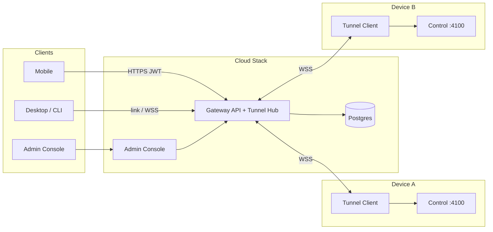

# Cloud Relay（手机 ↔ 本地 Control）设计规格

**Date**: 2026-08-11  
**Status**: draft  
**Related ADR**: [ADR-0002](../../adr/0002-cloud-relay-for-mobile-control.md)

## 0. Locked Decisions（2026-08-11）

| 议题 | 决定 |
|------|------|
| 默认云 | **提供**。客户端内置可配置默认 `cloudBaseUrl`；可覆盖为自建/本地 |
| 生产入口 | **域名上线前再定**；运行时只认 `PUBLIC_BASE_URL`（支持 `https://域名` 或 `http(s)://公网IP:端口`） |
| 开发部署 | 调试阶段 **本地 docker-compose / 本地进程** 跑同一套 Gateway+DB+Console |
| 生产部署 | **docker-compose 一等公民**，可部署到单机或集群（K8s 可后续用同一镜像） |
| 控制台 | **Admin Console**（shadcn/ui）：设备列表、在线状态、密钥、吊销、workspace |
| 多 CLI | **允许同一 workspace 多 device 同时在线**；请求按 `deviceId` 路由 |
| Client Token | **JWT**（含 `jti`，支持黑名单吊销） |
| Access Key × QR | **一 workspace 一把 accessKey**；任意设备的手机 QR 都带「当前 accessKey + 该 deviceId」；仅 `rotate` 后旧 key 失效 |
| 大 body | MVP **单帧 bodyBase64 上限 8MiB**；超限返回 `413 payload_too_large`；Phase 2 再做分片 |
| Admin 日志 | Phase 1 **不做请求日志页**；Overview 只显示在线数等计数；写操作进 `audit_events`（吊销/轮换） |

## 1. Overview

在保留 **Local（局域网直连）** 的前提下，增加 **Cloud（云端中继）**：

- 手机通过**默认云域名**（或本地/自建覆盖）+ 连接密钥（或扫码）接入。
- 云端把请求转发到用户指定的本机 CLI Control Server。
- 本机执行 Agent 后，经隧道把响应与 SSE 回传手机。
- 运维人员通过 **Admin Console** 查看与管理已连接设备。

本地环境（Control / `PiAgentService` / 仓库 / 工具）**不做搬迁**。



## 2. Goals / Non-Goals

### Goals

- 异地手机稳定调用本机 Agent（prompt、interaction、SSE）。
- Local 零破坏；Cloud 有默认入口。
- 多 CLI 同时在线并可管理。
- 本地可完整调试；生产用 docker-compose 部署。
- Admin Console（shadcn）可看设备与做吊销/轮换。
- JWT 作为手机侧 Bearer。

### Non-Goals（MVP）

- 不把 Agent 跑在云端。
- 不做完整 C 端账号/OAuth（Admin 用 `ADMIN_TOKEN`；手机用 accessKey）。
- 不做 E2E 加密 / P2P。
- 不替换局域网配对码。

## 3. Concepts

| 概念 | 含义 |
|------|------|
| **Workspace** | 云端逻辑空间；持有 accessKey；可挂多台 Device |
| **Device（CLI）** | 已 link 的本机实例；`deviceId` + device credential；维持一条 tunnel |
| **Client（Mobile）** | 用 accessKey 换 JWT，经云访问某 Workspace，并选定 `deviceId` |
| **Access Key** | 手机连接密钥（可扫码） |
| **Admin** | 持有 `ADMIN_TOKEN` 的控制台操作者 |
| **Default Cloud** | 产品内置默认 Gateway URL；dev 可指到 `http://localhost:...` |

## 4. Connection Modes

```ts
type ConnectionMode = 'local' | 'cloud';

type ConnectionProfile = {
  mode: ConnectionMode;
  // local
  baseUrl?: string;
  pairCode?: string;
  token?: string;
  // cloud
  cloudBaseUrl?: string;     // 缺省 = 内置 DEFAULT_CLOUD_BASE_URL
  workspaceId?: string;
  deviceId?: string;         // 多 CLI 时必选或使用 defaultDeviceId
  accessKey?: string;
  token?: string;            // JWT
};
```

| 模式 | `effectiveBaseUrl` | 鉴权 |
|------|-------------------|------|
| local | LAN URL | `POST /api/v1/auth/pair` |
| cloud | `cloudBaseUrl \|\| DEFAULT_CLOUD_BASE_URL` | `POST /cloud/v1/auth/redeem` → JWT |

**默认云 URL**

| 环境 | 值 |
|------|-----|
| 客户端内置占位 | 编译期/配置项 `DEFAULT_CLOUD_BASE_URL`；上线前由发布配置写入真实公网入口（域名或 `http(s)://IP:port`） |
| 本地调试 | `http://127.0.0.1:8787`（compose 映射 Gateway） |
| 覆盖方式 | `PUBLIC_BASE_URL`（服务端写进 QR）/ CLI `--url` / 手机高级设置 / QR 内 `cloudBaseUrl` |

服务端与客户端**都不写死最终域名**；只依赖可配置 base URL。

## 5. Components

| 组件 | 路径建议 | 职责 |
|------|----------|------|
| **Gateway** | `services/cloud-gateway` | 鉴权、JWT、tunnel hub、反代、admin API |
| **Admin Console** | `apps/cloud` | shadcn 设备/密钥管理 UI |
| **Postgres** | compose 服务 | 持久化 workspace/device/黑名单 |
| **CLI Tunnel** | `crates/giteam-core/src/cloud` | 出站 WSS + 回环转发 |
| **Desktop / Mobile** | 现有 apps | link、选设备、扫码、JWT |

### 转发策略（锁定）

```text
Mobile → Gateway → (按 deviceId 选 tunnel) → CLI → 127.0.0.1:{port} → Control → PiAgent
```

管理类 loopback API 不经云暴露；业务白名单见 §7.2。

## 6. Auth Design

### 6.1 凭证

| 凭证 | 持有者 | 形态 |
|------|--------|------|
| `linkTicket` | 短时 | 一次性，TTL ≤ 10min |
| `deviceToken` | CLI | `gtm_dev_...` opaque，可吊销（tunnel 鉴权） |
| `accessKey` | 用户/手机 | `gtm_aks_...`，可 rotate |
| `client JWT` | 手机 | Bearer JWT |
| `ADMIN_TOKEN` | 控制台/运维 | 环境变量；调用 `/cloud/v1/admin/*` |

Local `pairCode` **不用于** Cloud。

### 6.2 JWT 声明（锁定）

```json
{
  "iss": "giteam-cloud",
  "sub": "client",
  "wid": "ws_...",
  "did": "dev_...",
  "jti": "uuid",
  "iat": 1710000000,
  "exp": 1710086400
}
```

| 字段 | 含义 |
|------|------|
| `wid` | workspaceId |
| `did` | 签发时绑定的默认 deviceId（可被请求头覆盖，见 §6.5） |
| `jti` | 吊销黑名单键 |

- 算法：`HS256`（MVP，密钥来自 `JWT_SECRET`）或后续 RS256。
- TTL：默认 **24h**；过期后用 accessKey 重新 redeem。
- 校验：签名 + `exp` + `jti` 不在 blacklist。
- Admin 吊销 JWT：写入 `jwt_blacklist(jti, expires_at)`。

Device tunnel **不用 JWT**，继续用 `deviceToken`（长连接、易轮换、与手机凭证分离）。

### 6.3 CLI Link

```text
1. giteam cloud link [--url ...]
2. POST /cloud/v1/device/link/begin
   → workspaceId | 加入已有 workspace（见下）, linkTicket, deviceId, accessKey?, qrPayload
3. POST /cloud/v1/device/link/complete { linkTicket } → deviceToken
4. WSS /cloud/v1/tunnel  Authorization: Bearer <deviceToken>
5. presence = online
```

**加入已有 workspace**：`link/begin` 可带 `accessKey` 或 admin 签发的 `inviteTicket`，从而第二台、第三台 CLI 挂到同一 workspace。

### 6.4 Mobile Redeem

```text
POST /cloud/v1/auth/redeem
{ "accessKey": "gtm_aks_...", "deviceId": "dev_..."? }
→ {
    "workspaceId", "deviceId", "token": "<JWT>", "tokenType": "Bearer",
    "expiresAt", "devices": [{ "id", "name", "online" }]
  }
```

若未传 `deviceId`：  
- 仅 1 台 online → 自动选中；  
- 多台 online → 返回 `409 device_selection_required` + devices 列表，手机弹出选择。

### 6.5 请求路由（多 CLI）

优先级：

1. 请求头 `X-Giteam-Device-Id: dev_...`（若有且属于该 workspace）
2. JWT `did`
3. workspace `default_device_id`（控制台/CLI 可设置）
4. 若仍歧义且多台 online → `409 device_selection_required`
5. 目标 device offline → `503 device_offline`

`GET /api/v1/health`（经云）返回该 workspace 下所有 devices 的 online 摘要。

### 6.6 鉴权边界

- Gateway 验 JWT → `wid` / `did`。
- 选中 tunnel；**不**把 JWT 转给本机。
- 本机回环用 tunnel service token（仅 loopback）。

## 7. Cloud HTTP API

- `/cloud/v1/*`：控制面  
- `/cloud/v1/admin/*`：控制台（`Authorization: Bearer <ADMIN_TOKEN>`）  
- `/api/v1/*`：业务反代（与本地同构）

### 7.1 控制面（摘要）

| 方法 | 路径 | 说明 |
|------|------|------|
| POST | `/cloud/v1/device/link/begin` | 创建或加入 workspace |
| POST | `/cloud/v1/device/link/complete` | 换 deviceToken |
| POST | `/cloud/v1/auth/redeem` | accessKey → JWT |
| GET | `/cloud/v1/workspace/status` | 设备列表与 online |
| POST | `/cloud/v1/workspace/access-key/rotate` | 轮换 accessKey（需 JWT 或 admin） |
| POST | `/cloud/v1/auth/revoke` | 吊销当前 JWT（`jti`） |

`link/begin` 响应示例：

```json
{
  "workspaceId": "ws_...",
  "deviceId": "dev_...",
  "linkTicket": "ltk_...",
  "expiresAt": 1710000000,
  "accessKey": "gtm_aks_...",
  "qrPayload": {
    "mode": "cloud",
    "cloudBaseUrl": "<PUBLIC_BASE_URL>",
    "workspaceId": "ws_...",
    "deviceId": "dev_...",
    "accessKey": "gtm_aks_..."
  }
}
```

规则：workspace **共享一把** accessKey；第二台及以后 CLI link 返回**同一把** key（明文可再展示一次便于扫码），QR 始终带「accessKey + 本机 deviceId」。`rotate` 后旧 key 全部失效。

### 7.2 业务面白名单

| 路径 | 云暴露 |
|------|--------|
| `GET /api/v1/health` | 是（聚合 devices） |
| `/api/v1/agent/*` | 是 |
| `GET /api/v1/repository/list` | 是 |
| `/api/v1/auth/pair`、`/api/v1/pair/*`、`/api/v1/admin/control/*` | **否** |

Health 示例：

```json
{
  "ok": true,
  "mode": "cloud",
  "workspaceId": "ws_...",
  "devices": [
    { "id": "dev_a", "name": "macbook", "online": true },
    { "id": "dev_b", "name": "desktop", "online": true }
  ],
  "selectedDeviceId": "dev_a",
  "noAuth": false
}
```

### 7.3 Admin API

均需 `ADMIN_TOKEN`。

| 方法 | 路径 | 说明 |
|------|------|------|
| GET | `/cloud/v1/admin/workspaces` | 列表 |
| GET | `/cloud/v1/admin/workspaces/:id` | 详情 + devices |
| GET | `/cloud/v1/admin/devices` | 全量/筛选；含 online、lastSeen、version |
| POST | `/cloud/v1/admin/devices/:id/revoke` | 吊销 deviceToken，断开 tunnel |
| POST | `/cloud/v1/admin/workspaces/:id/access-key/rotate` | 轮换并返回新 key（仅一次明文） |
| POST | `/cloud/v1/admin/workspaces/:id/default-device` | 设置 `default_device_id` |
| POST | `/cloud/v1/admin/jwt/revoke` | body `{ jti }` 或按 workspace 批量 |
| GET | `/cloud/v1/admin/metrics` | 在线数、请求计数（MVP 可简） |

## 8. Tunnel Protocol

与前版相同（WSS、`v:1` JSON 帧、SSE 原样转发）。补充：

- Hub 按 `deviceId` 索引连接；同一 `deviceId` 新连接踢旧连接（单设备单 tunnel）。
- 多 Gateway 副本时：MVP **单 replica 承载 tunnel**（compose 可 `deploy.replicas: 1` 或 sticky）；Phase 2 再上 Redis presence + pub/sub。

帧类型见原设计：`hello` / `ping`/`pong` / `http.request|response*|cancel` / `error`。

本地回环：`X-Giteam-Tunnel-Service-Token`，Cloud 永不持有。

## 9. Admin Console（shadcn）

### 9.1 定位

- 独立前端：`apps/cloud`（Vite + React + Tailwind + **shadcn/ui**）。
- 风格对齐 Desktop 已有 shadcn 语义色与组件习惯（Sidebar / Table / Card / Badge / Dialog / Dropdown）。
- 登录：粘贴/保存 `ADMIN_TOKEN`（MVP）；后续可加 OIDC。

### 9.2 页面结构

```text
/login
/                   → Overview：在线设备数、workspace 数、近 24h 请求
/devices            → 设备表：name、workspace、online、lastSeen、version、动作
/workspaces         → workspace 表：accessKey 状态、default device、设备数
/workspaces/:id     → 详情：设备列表、轮换 key、设默认设备、吊销
/settings           → Gateway 信息、只读配置提示
```

### 9.3 设备管理能力（MVP）

- 实时/轮询在线状态（Badge：Online / Offline）
- 强制下线（revoke device）
- 查看 deviceId、名称、clientVersion、connectedAt
- 从 workspace 详情复制手机 QR 所需字段 / 显示 accessKey 轮换结果
- 设置 default device

### 9.4 UI 组件建议

| 场景 | shadcn |
|------|--------|
| 布局 | Sidebar + Separator |
| 列表 | Table + Badge + DropdownMenu |
| 确认吊销 | AlertDialog |
| 轮换 key | Dialog + 一次性展示 + Copy button |
| 状态 | Badge / Tooltip |
| 空态 | 简单 Empty 文案 |

## 10. Deployment

### 10.1 本地开发（默认路径）

```bash
cd services/cloud
docker compose up -d    # gateway + postgres + console
# Gateway: http://127.0.0.1:8787
# Console: http://127.0.0.1:8788
```

CLI：

```bash
giteam cloud link --url http://127.0.0.1:8787
```

手机高级设置或 QR 带 `cloudBaseUrl: http://<dev-machine-lan>:8787`（真机不能写 127.0.0.1 指到手机自己）。

也可 `cargo run` / `pnpm dev` 分服务本地跑，compose 只起 Postgres。

### 10.2 docker-compose（生产/集群友好）

建议目录：`services/cloud/docker-compose.yml`

```yaml
services:
  postgres:
    image: postgres:16
    volumes: [pgdata:/var/lib/postgresql/data]
    environment:
      POSTGRES_PASSWORD: ${POSTGRES_PASSWORD}
      POSTGRES_DB: giteam_cloud

  gateway:
    image: ghcr.io/giteam/cloud-gateway:${TAG:-latest}
    ports: ["8787:8787"]
    environment:
      DATABASE_URL: postgres://...
      JWT_SECRET: ${JWT_SECRET}
      ADMIN_TOKEN: ${ADMIN_TOKEN}
      PUBLIC_BASE_URL: ${PUBLIC_BASE_URL:-http://127.0.0.1:8787}
    depends_on: [postgres]
    # tunnel 状态：MVP 单实例
    deploy:
      replicas: 1

  console:
    image: ghcr.io/giteam/cloud:${TAG:-latest}
    ports: ["8788:80"]
    environment:
      VITE_GATEWAY_URL: ${PUBLIC_BASE_URL:-http://gateway:8787}
    depends_on: [gateway]

  # 可选：caddy/traefik 做 TLS
volumes:
  pgdata:
```

集群：同一镜像 + 外部 Postgres；Gateway 在 Phase 1 **保持 1 个可写 tunnel 节点**（或文档标明 sticky session）。Console 可多副本无状态。

### 10.3 配置清单

| 变量 | 用途 |
|------|------|
| `JWT_SECRET` | 签/验手机 JWT |
| `ADMIN_TOKEN` | 控制台 |
| `DATABASE_URL` | Postgres |
| `PUBLIC_BASE_URL` | 写入 QR 的默认云 URL |
| `CORS_ORIGINS` | Console / 可选 |

## 11. Client Changes

### 11.1 CLI

```text
giteam cloud link [--url] [--access-key]   # 创建或加入 workspace
giteam cloud status
giteam cloud unlink
giteam cloud devices                        # 列出同 workspace（需云 API）
giteam cloud access-key show|rotate
```

配置示例：

```json
{
  "enabled": true,
  "cloudBaseUrl": "http://127.0.0.1:8787",
  "workspaceId": "ws_...",
  "deviceId": "dev_...",
  "deviceToken": "gtm_dev_...",
  "defaultForMobile": true
}
```

`service serve` 在 enabled 时自动维持 tunnel。

### 11.2 Desktop

- 「云端连接」：link、online、设备名、复制/展示手机 QR（含 `deviceId`）。
- 局域网 QR 并行保留。

### 11.3 Mobile

- Local / Cloud 分段；Cloud 默认填内置/已配置 URL（可改）。
- redeem 后若多设备 → 选择器；持久化 `deviceId`。
- 请求带 `Authorization: JWT` + `X-Giteam-Device-Id`。
- 401 → 自动 redeem；503 →「设备离线」。

Cloud QR：

```json
{
  "mode": "cloud",
  "cloudBaseUrl": "<PUBLIC_BASE_URL>",
  "workspaceId": "ws_...",
  "deviceId": "dev_...",
  "accessKey": "gtm_aks_..."
}
```

## 12. Security

| 项 | 要求 |
|----|------|
| 生产 TLS | HTTPS/WSS（compose 前挂 Caddy/Traefik/ ingress） |
| Access Key | ≥128 bit；rotate 立即失效 |
| JWT | HS256 + 短 TTL + jti 黑名单 |
| ADMIN_TOKEN | 强随机；仅控制台/CI |
| 路径白名单 | agent / repository / health |
| 限流 | redeem / admin / prompt |
| 日志 | 不落 prompt 全文 |
| noAuth | Cloud 永不启用 |

## 13. Error Model

| 场景 | HTTP | code |
|------|------|------|
| accessKey 无效 | 401 | `invalid_access_key` |
| JWT 过期/签名失败 | 401 | `token_expired` / `invalid_token` |
| JWT 已吊销 | 401 | `token_revoked` |
| 需选择设备 | 409 | `device_selection_required` |
| 目标设备离线 | 503 | `device_offline` |
| 无任何设备在线 | 503 | `no_device_online` |
| 路径未允许 | 403 | `path_forbidden` |
| `payload` 过大 | 413 | `payload_too_large` |
| 本机 Control 错误 | 透传 status + body | — |

## 14. Data Model

```text
workspaces(
  id, created_at, access_key_hash, access_key_id,
  default_device_id, status
)
devices(
  id, workspace_id, device_token_hash, name,
  client_version, last_seen_at, status, created_at
)
jwt_blacklist(jti, workspace_id, expires_at)
audit_events(id, workspace_id, type, meta_json, created_at)  -- 可选
admin 不建用户表；ADMIN_TOKEN 来自环境变量
```

在线状态：**内存 presence**（Gateway 进程）+ `devices.last_seen_at` 落库；进程重启后以 tunnel 重连为准。

## 15. Phased Delivery

### Phase 0（可选）

公网/局域网 SSE 摸底。

### Phase 1 — MVP

1. Gateway：Postgres、link/redeem、JWT、tunnel hub、白名单反代、admin API  
2. docker-compose（gateway + postgres + console）本地可起  
3. CLI tunnel + `giteam cloud *`  
4. Admin Console：devices / workspaces 基础页（shadcn）  
5. Mobile Cloud 配对 + 多设备选择  
6. Desktop link / QR  
7. 文档：默认云 URL、本地调试、compose 部署  

**验收**

- [ ] `docker compose up` 后本地闭环：两台 CLI link 同一 workspace，均 online  
- [ ] 手机选 device A/B 分别 prompt + SSE 成功  
- [ ] Console 可见两台设备，能 revoke 其中一台  
- [ ] JWT 过期/吊销后 401；重新 redeem 成功  
- [ ] Local 模式回归  

### Phase 2

- accessKey/device 轮换 UX 完善  
- JWT 批量吊销、审计日志  
- SSE 重连硬化  
- Gateway 多实例 + Redis presence（可选）  

### Phase 3

- 官方托管默认云运营、C 端账号  
- E2E / P2P  

## 16. Repository Layout

```text
services/cloud/
  docker-compose.yml
  .env.example
  gateway/                 # Cloud Gateway
  README.md
apps/cloud/                # shadcn Admin Console (Giteam Cloud)
crates/giteam-core/src/cloud/
apps/cli/ ...
apps/desktop/ ...
apps/mobile/ ...
docs/adr/0002-cloud-relay-for-mobile-control.md
docs/superpowers/specs/2026-08-11-cloud-relay-mobile-control-design.md
```

Gateway 语言：**Rust (axum)**（已锁定）。Console：**Vite React + shadcn**。

## 17. Resolved Defaults（不再开放）

| 项 | 决定 | 依据 |
|----|------|------|
| 公网入口 | 仅 `PUBLIC_BASE_URL`；支持域名或公网 IP；上线前再填 | 运维解耦 |
| Access Key × QR | 每 workspace 一把；每台设备 QR 都带该 key + 本机 `deviceId` | 扫码直达该机，轮换统一失效 |
| Body 上限 | 8MiB / 单帧 | 覆盖常见截图；避免 WSS 帧膨胀 |
| Admin 日志 | Phase 1 无请求日志页；Overview 计数 + 写操作 audit | 成熟 MVP 范围 |
| Gateway 语言 | **Rust (axum)** | 与 monorepo/`giteam-core` 同栈，WSS/反代成熟 |
| Console | Vite + React + Tailwind + shadcn | 与 Desktop 一致 |
| Tunnel 多副本 | Phase 1 **单 Gateway 实例**承载 WSS | 避免过早上 Redis；compose `replicas: 1` |
| Device JWT 覆盖 | 允许 Header `X-Giteam-Device-Id` 覆盖 JWT `did`（须同 workspace） | 换机无需重新 redeem |
| JWT TTL | 24h；无 refresh token，过期重新 redeem | 简单可靠 |
| 加入已有 workspace | `link/begin` 传现有 `accessKey` | 标准 invite-by-secret |

规格状态：**ready for implementation**。实施计划见 `docs/superpowers/plans/2026-08-11-cloud-relay-phase1.md`。

---

## Appendix A — 代码触点

| 现有 | 关系 |
|------|------|
| `control.rs` | Local 不变；可选 tunnel service token |
| `controlApi.ts` | + `redeemCloudAccess` |
| `agent/client.ts` | `baseUrl` + JWT + `X-Giteam-Device-Id` |
| `usePairingController.ts` | mode 分流 + 设备选择 |
| `public_base_url` | 与 Cloud Relay 正交 |
| Desktop shadcn | Console 可复用组件模式，但是独立 app |

## Appendix B — 一句话

**可配置公网入口做信使与设备控制台；多台 CLI 出站挂上同一 workspace；手机 JWT 选设备访问；本地 compose 调试，同一套镜像 docker-compose 上集群。**
