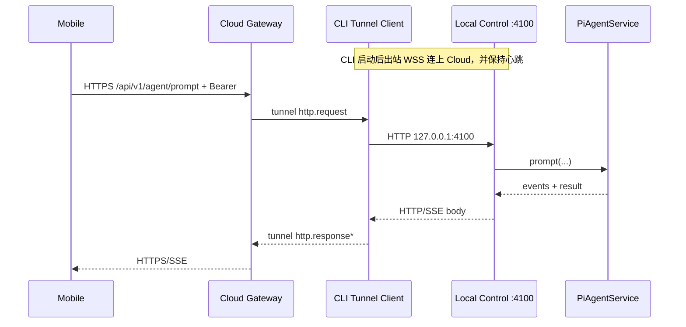

# Cloud Relay（手机 ↔ 本地 Control）设计规格

**Date**: 2026-08-11  
**Status**: draft  
**Related ADR**: [ADR-0002](../../adr/0002-cloud-relay-for-mobile-control.md)

## 1. Overview

在保留现有 **Local（局域网直连）** 的前提下，增加 **Cloud（云端中继）** 连接模式：

- 手机通过云端域名 + 连接密钥（或扫码）接入。
- 云端把请求转发到用户本机 CLI Control Server。
- 本机执行 Agent 后，经同一隧道把响应与 SSE 事件回传手机。

本地环境（Control Server / `PiAgentService` / 仓库 / 工具）**不做搬迁**。



## 2. Goals / Non-Goals

### Goals

- 异地手机可稳定调用本机 Agent（含 prompt、interaction、SSE）。
- Local 模式行为与配置零破坏。
- 手机业务协议尽量复用现有 `/api/v1/*`。
- CLI 一键 link；手机密钥或扫码即可连。
- 明确的在线/离线与鉴权错误语义。

### Non-Goals（MVP）

- 不把 Agent 跑在云端。
- 不做完整账号体系 / 计费（可用预共享密钥）。
- 不做端到端加密（Cloud 可见明文；后续可选）。
- 不做 P2P / WebRTC。
- 不替换现有局域网配对码流程。

## 3. Concepts

| 概念 | 含义 |
|------|------|
| **Workspace** | 一次「本机环境」在云端的逻辑空间，绑定一台（MVP）或少数 CLI 设备 |
| **Device（CLI）** | 已 link 的本机 giteam service，持有 device credential，维持 tunnel |
| **Client（Mobile）** | 持有 client access token，经云访问某 Workspace |
| **Link Key / Ticket** | 短时或一次性凭证，用于 CLI 完成绑定 |
| **Access Key** | 手机侧连接密钥（可扫码），兑换 client token |
| **Tunnel** | CLI → Cloud 的出站长连接，承载反向 HTTP/SSE 代理 |

## 4. Connection Modes

手机持久化连接配置升级为：

```ts
type ConnectionMode = 'local' | 'cloud';

type ConnectionProfile = {
  mode: ConnectionMode;
  // local
  baseUrl?: string;          // http://192.168.x.x:4100
  pairCode?: string;
  token?: string;            // Bearer 或 __NO_AUTH__
  // cloud
  cloudBaseUrl?: string;     // https://cloud.example.com （可自建）
  workspaceId?: string;
  accessKey?: string;        // 仅本地缓存用于重连兑换；可清空
  token?: string;            // Cloud 签发的 client Bearer
};
```

| 模式 | 手机 `effectiveBaseUrl` | 鉴权 |
|------|-------------------------|------|
| local | 用户/扫码得到的 LAN URL | 现有 `POST /api/v1/auth/pair` |
| cloud | `cloudBaseUrl` | `POST /cloud/v1/auth/redeem` → Bearer，再调 `/api/v1/*` |

Cloud 模式下 **禁止** LAN 扫描作为主路径；二维码/密钥是唯一推荐入口。

## 5. High-Level Components

| 组件 | 位置 | 职责 |
|------|------|------|
| **Cloud Gateway** | 新服务（建议独立 repo 或 `services/cloud-gateway`） | TLS 终结、鉴权、Workspace 路由、tunnel hub、HTTP/SSE 反代 |
| **CLI Tunnel Client** | `giteam-core` 新模块 + CLI 子命令 | 出站 WSS、本地回环转发、心跳、重连 |
| **Desktop Cloud UI** | `apps/desktop` | link / unlink / 状态 / 手机连接 QR |
| **Mobile Cloud Pairing** | `apps/mobile` | 模式切换、密钥输入、扫码、token 持久化 |
| **Local Control** | 现有 `control.rs` | **不变**；仅被 tunnel 回环访问 |

### MVP 转发策略（锁定）

```text
Cloud → (WSS) → CLI Tunnel → HTTP → 127.0.0.1:{controlPort} → 现有路由 → PiAgentService
```

不在 tunnel 内直接调用 `PiAgentService`（减少双入口漂移）。管理类 loopback-only API（如 `/api/v1/pair/*`、部分 admin）**默认不经云暴露**；Cloud 只放行白名单路径。

## 6. Auth Design

### 6.1 角色与密钥

| 凭证 | 持有者 | 用途 | 建议形态 |
|------|--------|------|----------|
| `linkTicket` | 短时展示/QR | CLI 首次绑定 Workspace | 高熵，TTL ≤ 10min，一次性 |
| `deviceToken` | CLI 本地存储 | 建立/恢复 tunnel | `gtm_dev_...`，可吊销 |
| `accessKey` | 用户分享给手机 | 兑换 client token | `gtm_aks_...`，可轮换 |
| `clientToken` | 手机 | 调用 Cloud `/api/v1/*` | JWT 或 opaque Bearer，TTL 可续期 |

Local 的 6 位 `pairCode` **不用于** Cloud。

### 6.2 CLI Link 流程

```text
1. 用户: giteam cloud link [--cloud-url ...]
   或 Desktop「连接云端」
2. CLI → Cloud POST /cloud/v1/device/link/begin
   ← { workspaceId, linkTicket, expiresAt, qrPayload }
3. 展示 QR / 打印 ticket（可选：已有 accessKey 则跳过手机侧再配对）
4. CLI → Cloud WSS /cloud/v1/tunnel?ticket=... 或先 redeem deviceToken 再连
5. Cloud 标记 device online
6. （可选）同时生成/展示 mobile access QR
```

### 6.3 Mobile Redeem 流程

```text
1. 用户输入 accessKey，或扫码得到:
   { mode:"cloud", cloudBaseUrl, accessKey, workspaceId? }
2. Mobile → Cloud POST /cloud/v1/auth/redeem
   body: { accessKey }
   ← { workspaceId, token, tokenType:"Bearer", expiresAt }
3. 持久化 ConnectionProfile(mode=cloud, ...)
4. 后续所有 agent API: Authorization: Bearer <clientToken>
   Host: cloudBaseUrl
```

### 6.4 鉴权边界

- Cloud 校验 `clientToken` → 解析 `workspaceId`。
- 查该 workspace 是否有 **online tunnel**；否则 `503 device_offline`。
- 将请求转发到对应 tunnel；**不**把 `clientToken` 原样传给本机（本机回环可用内部 service token 或 `noAuth` 仅限 loopback——见 §10）。

## 7. Cloud HTTP API

前缀约定：

- `/cloud/v1/*`：云控制面（link、redeem、status）
- `/api/v1/*`：与本地 Control **同构**的业务面（由 Gateway 反代）

### 7.1 控制面（草案）

#### `POST /cloud/v1/device/link/begin`

创建 CLI 启动绑定。

Request:

```json
{ "deviceName": "macbook-pro", "clientVersion": "x.y.z" }
```

Response:

```json
{
  "workspaceId": "ws_...",
  "linkTicket": "ltk_...",
  "expiresAt": 1710000000,
  "accessKey": "gtm_aks_...",
  "qrPayload": {
    "mode": "cloud",
    "cloudBaseUrl": "https://cloud.example.com",
    "workspaceId": "ws_...",
    "accessKey": "gtm_aks_..."
  }
}
```

MVP 可在 begin 时一并签发 `accessKey`（单 workspace 单密钥）。后续再拆「只 link 设备 / 另发手机密钥」。

#### `POST /cloud/v1/device/link/complete`

可选：若 WSS 不用 ticket 直连，则用此接口换 `deviceToken`。

```json
{ "linkTicket": "ltk_...", "devicePublicKey": null }
```

→ `{ "deviceToken": "gtm_dev_...", "workspaceId": "ws_..." }`

#### `POST /cloud/v1/auth/redeem`

手机兑换。

```json
{ "accessKey": "gtm_aks_..." }
```

→ `{ "workspaceId": "ws_...", "token": "...", "tokenType": "Bearer", "expiresAt": 1710003600 }`

#### `GET /cloud/v1/workspace/status`

需 client/device 鉴权。

```json
{
  "workspaceId": "ws_...",
  "deviceOnline": true,
  "deviceName": "macbook-pro",
  "connectedAt": 1710000000
}
```

#### `POST /cloud/v1/workspace/revoke`

吊销 accessKey 或 deviceToken（Desktop/CLI 管理）。

### 7.2 业务面反代

Gateway 对外暴露与本地一致的路径（手机零改或少改）：

| 方法 | 路径 | 云暴露 |
|------|------|--------|
| GET | `/api/v1/health` | 是（可返回 cloud 聚合健康：gateway ok + device online） |
| POST | `/api/v1/auth/pair` | **否**（Cloud 用 redeem） |
| * | `/api/v1/agent/*` | 是 |
| GET | `/api/v1/repository/list` | 是 |
| * | `/api/v1/pair/*` | **否** |
| * | `/api/v1/admin/control/*` | **否** |
| PUT | `/api/v1/admin/mobile/model-*` | MVP **否** 或仅 device 在线且显式开启 |

`GET /api/v1/health`（经云）建议：

```json
{
  "ok": true,
  "mode": "cloud",
  "workspaceId": "ws_...",
  "deviceOnline": true,
  "noAuth": false
}
```

手机 Cloud 连接前可先打 health；`deviceOnline=false` 时提示启动本机 link。

## 8. Tunnel Protocol

### 8.1 传输

- CLI → Cloud：`WSS /cloud/v1/tunnel`
- 鉴权：`Authorization: Bearer <deviceToken>` 或 `Sec-WebSocket-Protocol` / query ticket（仅首次）
- 心跳：双向 `ping` / `pong` JSON，建议 15–20s；超时 45s 视作断线

### 8.2 帧格式（JSON，versioned）

```ts
type TunnelFrame =
  | { v: 1; type: 'hello'; deviceId: string; workspaceId: string }
  | { v: 1; type: 'ping'; ts: number }
  | { v: 1; type: 'pong'; ts: number }
  | {
      v: 1;
      type: 'http.request';
      streamId: string;
      method: string;
      path: string;          // 含 query，如 /api/v1/agent/stream?sessionId=...
      headers: Record<string, string>;
      bodyBase64?: string;   // 小请求；大 body 可后续改 chunk
    }
  | {
      v: 1;
      type: 'http.responseStart';
      streamId: string;
      status: number;
      headers: Record<string, string>;
    }
  | {
      v: 1;
      type: 'http.responseBody';
      streamId: string;
      chunkBase64: string;
      end?: boolean;
    }
  | {
      v: 1;
      type: 'http.responseEnd';
      streamId: string;
    }
  | {
      v: 1;
      type: 'http.cancel';
      streamId: string;
      reason?: string;
    }
  | {
      v: 1;
      type: 'error';
      streamId?: string;
      code: string;
      message: string;
    };
```

### 8.3 SSE 映射

手机 `GET /api/v1/agent/stream`：

1. Gateway 建 upstream SSE 响应（`Content-Type: text/event-stream`）。
2. 发 `http.request` 给 CLI。
3. CLI 对本机 Control 建连接，读 body 流，持续 `http.responseBody`。
4. Gateway 把 chunk **原样**写入手机 SSE（保持 `event:` / `data:` 字节不重解析，避免破坏兼容）。
5. 手机断开 → Gateway `http.cancel` → CLI 关本地连接。

### 8.4 本地回环鉴权

Tunnel 打本机时：

- **推荐**：Control 增加仅 loopback 有效的 `X-Giteam-Tunnel-Service-Token`（CLI 与 Control 同进程或本地文件共享），Cloud 永不持有该 token。
- **过渡**：若 Control 与 tunnel 同进程且仅监听回环转发，可对来自 tunnel 的内部请求走 `ensure_authorized` 旁路（仍禁止外网直达 noAuth）。

不得把手机 `clientToken` 当成本地 Bearer 持久化到 `control-auth.json`。

## 9. Client Changes

### 9.1 CLI

新命令（示意）：

```text
giteam cloud link [--url https://...]
giteam cloud status
giteam cloud unlink
giteam cloud access-key show|rotate
```

配置落盘（与 `control-server.json` 并列），例如：

```json
{
  "enabled": true,
  "cloudBaseUrl": "https://cloud.example.com",
  "workspaceId": "ws_...",
  "deviceToken": "gtm_dev_...",
  "accessKey": "gtm_aks_..."
}
```

`giteam service serve/start` 在 `cloud.enabled` 时自动拉起 tunnel 监督协程（断线指数退避重连）。

### 9.2 Desktop

- 设置页增加「云端连接」区块：开关、状态点、Link、展示手机 QR（`mode:cloud` payload）、复制 accessKey、吊销。
- 现有局域网 QR **并行保留**，文案区分「同一 Wi-Fi」vs「云端」。

### 9.3 Mobile

- 入口：Local / Cloud 分段。
- Cloud：密钥输入框 + 扫码；扫码解析 `mode==="cloud"`。
- `createMobileAgentClient({ baseUrl: cloudBaseUrl, token: clientToken })` 复用。
- 401 → 若有 `accessKey` 则自动 `redeem` 一次（类似现有 pairAuth 重试）。
- 503 `device_offline` → 友好文案，不误报成「配对失败」。

二维码 payload（Cloud）：

```json
{
  "mode": "cloud",
  "cloudBaseUrl": "https://cloud.example.com",
  "workspaceId": "ws_...",
  "accessKey": "gtm_aks_..."
}
```

Local payload 保持现有字段；解析时若无 `mode` 则视为 `local`。

## 10. Security

| 项 | MVP 要求 |
|----|----------|
| 传输 | Cloud 对外强制 HTTPS/WSS |
| Access Key | ≥ 128 bit 熵；可 rotate；rotate 后旧 key 立即失效 |
| Client Token | 短 TTL（如 24h）+ 刷新或重新 redeem |
| Device Token | 可 revoke；unlink 后拒绝 tunnel |
| 路径白名单 | 仅 agent/repository/health |
| 限流 | 按 workspace / IP 限制 redeem 与 prompt |
| 日志 | 默认不落 prompt 全文（可采样长度/hash） |
| Local noAuth | Cloud 路径永不启用 |

威胁模型假设：用户信任自建或官方 Gateway 运营商。E2E 加密列为 Phase 3。

## 11. Error Model

| 场景 | HTTP | code |
|------|------|------|
| accessKey 无效 | 401 | `invalid_access_key` |
| clientToken 过期 | 401 | `token_expired` |
| 设备未 link / 离线 | 503 | `device_offline` |
| 路径未允许 | 403 | `path_forbidden` |
| tunnel 转发超时 | 504 | `tunnel_timeout` |
| 本机 Control 错误 | 透传 status + body | — |

手机应对 `device_offline` / `tunnel_timeout` 做专门 UI。

## 12. Data Model（Cloud）

MVP 可用 SQLite/Postgres：

```text
workspaces(id, created_at, access_key_hash, access_key_id, status)
devices(id, workspace_id, device_token_hash, name, last_seen_at, status)
client_sessions(id, workspace_id, token_hash, expires_at, revoked_at)
audit_events(id, workspace_id, type, meta_json, created_at)  -- 可选
```

只存哈希，不存明文 key/token（展示用明文仅在生成时返回一次；CLI 本地可存密文/权限收紧文件）。

## 13. Phased Delivery

### Phase 0 — 协议与公网 SSE 验证（可选，不交付产品）

- 用临时隧道验证手机 ↔ 本机 Control 的 SSE 稳定性。
- 产出：超时/心跳参数基线。

### Phase 1 — MVP（本设计主交付）

1. Cloud Gateway：redeem、link、tunnel hub、白名单反代。
2. CLI tunnel client + `giteam cloud *`。
3. Mobile Cloud 配对与错误语义。
4. Desktop 状态与 QR。
5. 文档：自建 Gateway 部署说明。

**验收**

- [ ] 异地手机凭 accessKey 连接成功。
- [ ] prompt + SSE 事件完整。
- [ ] interaction 审批往返成功。
- [ ] CLI 断网后手机收到 `device_offline`；恢复后自动可用。
- [ ] Local 模式回归通过。

### Phase 2 — 硬化

- accessKey 与 device 凭证轮换 UI。
- 多手机 client session 列表与踢下线。
- 更稳的 SSE 重连与 run 级恢复。
- 可观测性（workspace 在线指标）。

### Phase 3 — 增强

- 账号体系、多 workspace。
- E2E 加密。
- 可选 P2P 旁路。

## 14. Repository Layout（建议）

```text
services/cloud-gateway/          # 新服务（语言待定：Rust/Go/Node）
  src/
  README.md                      # 部署
crates/giteam-core/src/cloud/    # tunnel client + config
apps/cli/src/...                 # cloud 子命令
apps/desktop/src/...             # Cloud 设置 UI
apps/mobile/src/features/pairing/# mode 分流
docs/adr/0002-...
docs/superpowers/specs/2026-08-11-cloud-relay-mobile-control-design.md
```

Gateway 实现语言不阻塞设计：优先选团队能快速交付 WSS + HTTP 反代的栈。若希望与 `giteam-core` 共享类型，可用 Rust。

## 15. Open Questions

1. **官方托管 vs 仅自建**：产品是否提供默认 `cloud.giteam.*`，还是 MVP 只支持用户自建 Gateway？
2. **一 Workspace 多 CLI**：笔记本 + 台式同时在线时路由策略（拒绝双在线 / 主备 / 手动选择）？
3. **Access Key 是否在 link/begin 时自动生成并进 QR**：便利 vs 密钥展示面扩大。
4. **Client Token 用 JWT 还是 opaque**：JWT 减少中心存储；opaque 更易即时吊销。
5. **图片/大 body**：MVP base64 单帧上限（如 8MB）是否够用？

## 16. Implementation Order（工程拆分）

建议按垂直切片，避免大爆炸：

1. **契约冻结**：本规格评审通过；敲定 Open Questions 中 1/2/4。
2. **Gateway 骨架**：redeem + 内存版 workspace + 假 tunnel echo。
3. **CLI tunnel → 本地 health**：打通 `health` 往返。
4. **反代 agent prompt + stream**：核心路径。
5. **Mobile Cloud UI**：redeem + 复用 agent client。
6. **Desktop QR/状态**。
7. **硬化**：持久化 DB、重连、吊销、白名单、限流。

---

## Appendix A — 与现有代码的触点

| 现有 | 关系 |
|------|------|
| `crates/giteam-core/src/control.rs` | 保持 Local；增加可选 tunnel service token / 不改路由语义 |
| `apps/mobile/src/api/controlApi.ts` | 增加 `redeemCloudAccess`；local `pairAuth` 保留 |
| `apps/mobile/src/api/agent/client.ts` | `baseUrl` 指向云即可 |
| `apps/mobile/src/features/pairing/usePairingController.ts` | 按 `mode` 分流 |
| `ControlServerSettings.public_base_url` | 仍服务 Local/人工隧道；与 Cloud Relay 正交 |
| Desktop `controlPairPayload` | 增加 cloud payload 生成路径 |

## Appendix B — 一句话架构

**云端是带鉴权的公网信使；本地 CLI 主动接线并继续跑现有 Control + Agent；手机换入口与密钥，不换业务协议。**
