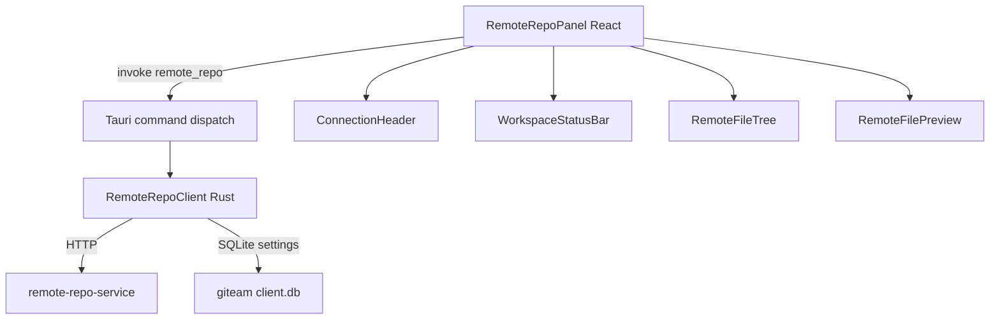

# Remote Repository Panel - Phase 1 Design

## Overview

Add a **Remote Repository Panel** to giteam Desktop's left sidebar. The panel becomes the in-product entry point for managing and using the linked remote repository (`remote-repo-skill-brainstorm_2_giteam`).

Phase 1 scope:
- Show connection status, current repository, branch, and service URL.
- Show workspace/session status: dirty state, workspace version, GitNexus readiness, MCP/Skill configured.
- Browse the remote workspace file tree lazily, with modified/untracked/deleted markers (preferred `/v1/files/tree`, fallback to `/v1/shell/run` + bounded `find`).
- Open files in a read-only preview in the main area via `/v1/files/read`.
- Provide explicit **Reconnect** and **Sync** actions with clear feedback states.

Phase 1 is intentionally a single-repository UX, but all data models and the Rust client are designed for multi-repository support so Phase 2 only needs to enable the repo selector.

## Steering Document Alignment

### Technical Standards (tech.md)

- **Tauri v2** command model: single `remote_repo` entry-point command dispatching on `action` to a typed Rust client.
- **React + TypeScript** frontend in `apps/desktop/src`.
- **shadcn/ui sidebar primitives** for the panel chrome.
- **SQLite** for settings persistence via the existing `commands::db` module.
- **HTTP/REST bridge** to `remote-repo-service` using `reqwest` (added to `Cargo.toml`).

### Project Structure (structure.md)

- New Rust module: `apps/desktop/src-tauri/src/remote_repo.rs` (client + models + command handler).
- New frontend modules under `apps/desktop/src/components/remote-repo/`:
  - `RemoteRepoPanel.tsx` — sidebar container
  - `ConnectionHeader.tsx`
  - `WorkspaceStatusBar.tsx`
  - `RemoteFileTree.tsx`
  - `RemoteFilePreview.tsx`
  - `remoteRepoApi.ts` — typed Tauri invoke wrappers
  - `types.ts` — shared TypeScript models
- Settings stored in a new SQLite table `remote_repo_configs` alongside existing giteam tables.

## Code Reuse Analysis

### Existing Components to Leverage

- **`apps/desktop/src/components/ui/sidebar.tsx`**: `Sidebar`, `SidebarContent`, `SidebarGroup`, `SidebarGroupLabel`, `SidebarMenu`, `SidebarMenuButton`, etc. for panel chrome.
- **`apps/desktop/src/lib/utils.ts`**: `cn()` helper for class merging.
- **`apps/desktop/src/lib/types.ts`**: extend existing repository/session types rather than duplicate them.
- **`apps/desktop/src-tauri/src/commands/db.rs`**: SQLite schema management pattern and `RepositoryEntry` model.
- **`remote-repo-service` REST API** (`src/remote_repo_service/app.py`): `list_repos`, `sync_repo`, `create_session`, `get_session_state`, `run_shell`, `read_file_slice`, `list_files`.

### Integration Points

- **Tauri invoke bridge**: frontend calls `invoke('remote_repo', { action, payload })`; Rust routes to `RemoteRepoClient` methods.
- **Settings persistence**: `remote_repo_configs` table stores `repo_id`, `service_url`, `api_key`, `default_ref`, and optional `session_id`.
- **Remote service HTTP API**: the bridge calls `POST /v1/repos`, `/v1/repos/sync`, `/v1/sessions`, `/v1/sessions/state`, `/v1/files/tree` (preferred) or `/v1/shell/run` (fallback), `/v1/files/read`, `/v1/graph/status`.
- **OpenCode integration (Phase 1 placeholder)**: "Open in OpenCode" / "Edit via MCP" buttons are disabled or show a "Coming soon" tooltip. They are visual placeholders for Phase 2.

## Architecture

### Modular Design Principles

- **Single File Responsibility**: each panel sub-component is its own file; the Rust client is isolated from command dispatch.
- **Component Isolation**: panel sections communicate through props and a local React context, not via large prop drilling.
- **Service Layer Separation**: Rust `RemoteRepoClient` owns all HTTP concerns (auth, retry, error mapping). Frontend only talks to Tauri.
- **No hard-coded repo ID**: every API call and data model carries `repo_id` even though the selector only shows one option in Phase 1.



## Components and Interfaces

### RemoteRepoClient (Rust)

- **Purpose**: Encapsulate all HTTP calls to the remote repository service and convert errors into giteam-friendly payloads.
- **Interfaces**:
  - `new(base_url: String, api_key: String) -> Self`
  - `get_connection_status(repo_id: &str) -> Result<ConnectionStatus>`
  - `sync_repo(repo_id: &str) -> Result<SyncResult>`
  - `create_session(repo_id: &str, ref_or_commit: Option<&str>) -> Result<SessionSummary>`
  - `get_session_state(session_id: &str) -> Result<SessionState>`
  - `list_workspace_files(session_id: &str, path: &str) -> Result<FileTreeNode>`
  - `read_file(session_id: &str, path: &str) -> Result<FileContent>`
  - `get_graph_status(repo_id: Option<&str>, session_id: Option<&str>) -> Result<GraphStatus>`
- **Dependencies**: `reqwest`, `serde`, `serde_json`, `thiserror`.
- **Reuses**: existing remote-repo-service REST contract.

### Remote Repo Tauri Command

- **Purpose**: Single invoke entry point so the frontend does not need to register dozens of commands.
- **Interfaces**: `remote_repo(action: String, payload: serde_json::Value) -> Result<serde_json::Value>`
- **Dispatch table**:
  - `"get_connection_status"`
  - `"sync_repo"`
  - `"create_session"`
  - `"get_session_state"`
  - `"list_files"`
  - `"read_file"`
  - `"get_graph_status"`
  - `"list_remote_configs"`
  - `"save_remote_config"`
- **Dependencies**: `RemoteRepoClient`, SQLite settings.

### RemoteRepoPanel (React)

- **Purpose**: Sidebar container that loads the active remote repo config, polls connection/session state, and renders sub-sections.
- **Interfaces**: none (top-level component mounted inside `App.tsx`).
- **Dependencies**: `RemoteRepoProvider`, `ConnectionHeader`, `WorkspaceStatusBar`, `RemoteFileTree`.

### ConnectionHeader (React)

- **Purpose**: Display repo selector, connection indicator, service URL tooltip, branch/version tags, Sync/Reconnect/Settings buttons.
- **Interfaces**: receives `repoId`, `connectionStatus`, `onSync`, `onReconnect`.
- **Dependencies**: shadcn `Button`, `Tooltip`.

### WorkspaceStatusBar (React)

- **Purpose**: Surface session age, workspace version, dirty state (highlighted), and capabilities (GitNexus + MCP configured).
- **Interfaces**: receives `sessionState`.
- **Dependencies**: shadcn `Badge`.

### RemoteFileTree (React)

- **Purpose**: Lazily loaded file tree with status markers. Clicking a file emits `onSelectFile`.
- **Interfaces**: receives `sessionId`, `onSelectFile(path)`.
- **Dependencies**: shadcn `Collapsible` or custom tree component, `lucide-react` icons.

### RemoteFilePreview (React)

- **Purpose**: Read-only file viewer shown in the main area when a file is selected.
- **Interfaces**: receives `sessionId`, `path`, `content`.
- **Dependencies**: existing code preview styling.

## Data Models

### Rust Models

```rust
pub struct RemoteRepoConfig {
    pub repo_id: String,
    pub name: String,
    pub service_url: String,
    pub api_key: String,
    pub default_ref: String,
    pub session_id: Option<String>,
}

pub struct ConnectionStatus {
    pub repo_id: String,
    pub online: bool,
    pub service_url: String,
    pub default_ref: String,
    pub default_commit: Option<String>,
    pub error: Option<String>,
}

pub struct SessionSummary {
    pub session_id: String,
    pub repo_id: String,
    pub base_commit: String,
    pub workspace_version: u64,
}

pub struct SessionState {
    pub session_id: String,
    pub repo_id: String,
    pub base_commit: String,
    pub workspace_version: u64,
    pub dirty: bool,
    pub modified_count: usize,
    pub untracked_count: usize,
    pub deleted_count: usize,
    pub created_at_ms: i64,
}

pub struct FileTreeNode {
    pub name: String,
    pub path: String,
    pub kind: FileNodeKind,
    pub status: FileStatus,
    pub children: Option<Vec<FileTreeNode>>,
}

pub enum FileNodeKind { File, Directory }

pub enum FileStatus { Unchanged, Modified, Untracked, Deleted, Conflict }

pub struct FileContent {
    pub path: String,
    pub content: String,
    pub workspace_version: u64,
    pub truncated: bool,
}

pub struct GraphStatus {
    pub target: String,
    pub state: String, // READY | STALE | INDEXING | FAILED
    pub last_indexed: Option<String>,
}
```

### TypeScript Models

```typescript
export type RemoteRepoConfig = {
  repoId: string;
  name: string;
  serviceUrl: string;
  apiKey: string;
  defaultRef: string;
  sessionId?: string;
};

export type ConnectionStatus = {
  repoId: string;
  online: boolean;
  serviceUrl: string;
  defaultRef: string;
  defaultCommit?: string;
  error?: string;
};

export type SessionState = {
  sessionId: string;
  repoId: string;
  baseCommit: string;
  workspaceVersion: number;
  dirty: boolean;
  modifiedCount: number;
  untrackedCount: number;
  deletedCount: number;
  createdAtMs: number;
};

export type FileTreeNode = {
  name: string;
  path: string;
  kind: "file" | "directory";
  status: "unchanged" | "modified" | "untracked" | "deleted" | "conflict";
  children?: FileTreeNode[];
};

export type FileContent = {
  path: string;
  content: string;
  workspaceVersion: number;
  truncated: boolean;
};
```

### SQLite Schema

```sql
CREATE TABLE IF NOT EXISTS remote_repo_configs (
    repo_id TEXT PRIMARY KEY,
    name TEXT NOT NULL,
    service_url TEXT NOT NULL,
    api_key TEXT NOT NULL DEFAULT '', -- Phase 1 prototype only; production must use OS keychain / secure storage
    default_ref TEXT NOT NULL DEFAULT 'main',
    session_id TEXT,
    updated_at_ms INTEGER NOT NULL
);
```

## Error Handling

### Scenario 1: Remote service unreachable
- **Handling**: `RemoteRepoClient` catches reqwest errors and returns `ConnectionStatus { online: false, error: ... }`. UI shows red indicator and enables Reconnect.
- **User impact**: panel remains visible; header shows "offline" badge; tree/preview disabled.

### Scenario 2: Session expired or invalid
- **Handling**: remote service returns `session_not_found`. Rust command clears stored `session_id` and prompts frontend to create a new session.
- **User impact**: status bar shows "No active session" with a "Create session" button.

### Scenario 3: File tree API missing
- **Handling**: if `remote-repo-service` does not yet expose `/v1/files/tree`, the client falls back to `run_shell` with a bounded `find` command and parses the output. Spec explicitly marks this as temporary and tracks adding a proper tree endpoint.
- **User impact**: file tree still loads, possibly slower; no visible difference.

### Scenario 4: Path traversal or out-of-bounds read
- **Handling**: remote service rejects invalid paths; Rust propagates the error code and message.
- **User impact**: toast/inline error; file preview remains empty.

### Scenario 5: Settings incomplete
- **Handling**: if no `RemoteRepoConfig` exists, panel shows a setup state with a settings button. Phase 1 ships with a default config for `remote-repo-skill-brainstorm_2_giteam` populated on first run.
- **User impact**: first-time users see the panel already connected; power users can edit URL/API key in settings.

## Testing Strategy

### Unit Testing (Rust)
- `RemoteRepoClient` serialization/deserialization of remote service responses.
- Error mapping for each remote service error code.
- File status parsing from `run_shell` fallback output.

### Integration Testing (Rust + remote service)
- Start a test instance of `remote-repo-service` on a random port; call Tauri command dispatcher and assert responses.
- Verify session create → list files → read file round-trip.
- Verify offline connection status.

### Frontend Testing
- `RemoteRepoPanel` renders each state (loading, offline, no session, dirty, clean).
- `RemoteFileTree` lazy-loads children and shows correct status badges.
- `WorkspaceStatusBar` highlights dirty state and formats session age.

### End-to-End (manual)
- Launch giteam Desktop; confirm panel shows linked repo.
- Click Sync and Reconnect; verify feedback.
- Select a file; verify read-only preview.
- Stop remote service; verify offline indicator and recovery on restart.

## Phase 2 Preloaded Hooks

These hooks are optional in Phase 1 and must not require changes to the remote service:

- Rust `RemoteRepoClient` interface includes an optional `get_agent_activity(session_id)` method returning `Vec<AgentEvent>`; Phase 1 returns an empty list or omits the method.
- TypeScript `SessionState` model includes an optional `agentActivitySummary?: AgentActivitySummary` field; Phase 1 leaves it undefined.
- TypeScript `FileTreeNode` includes an optional `agentOperation?: AgentOperationHint` field for future spinner/pulse indicators; Phase 1 leaves it undefined.
- Main preview area reserves a tab switcher for "File" / "Agent Activity" views but renders only the File tab in Phase 1.

## Open Questions / Decisions

1. **Fallback file tree implementation**: Use `run_shell` + `find` if `/v1/files/tree` is not available; add a proper endpoint in a follow-up.
2. **MCP configured signal**: Phase 1 reports MCP as configured whenever the giteam-side skill/MCP configuration for the linked repo exists; it does not detect whether OpenCode's MCP runtime is currently active.
3. **Polling cadence**: connection/session state refreshes every 5 seconds when panel is visible; file tree refreshes on explicit Sync or after shell commands.
4. **Default config seeding**: on first run, insert `remote-repo-skill-brainstorm_2_giteam` config pointing to `http://localhost:8000` (or environment override).

## Deferred From Phase 1

- Multi-repository selector UI.
- Agent execution history and result visualization.
- File editing / patch application through the panel.
- Full remote repo CRUD management.
- Permissions, audit, and shared-team features.
